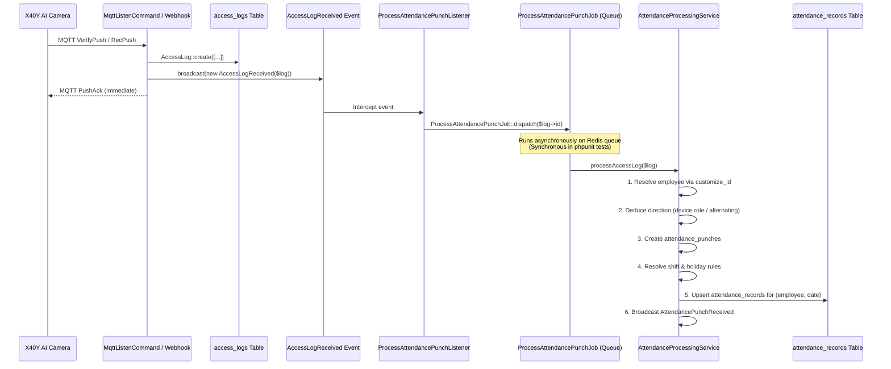

# Backend Architecture Survey & Safe Transformation Strategy
## Intelligent AI Camera Hub → Attendance & Visitor Management System

**Author:** Backend Architecture Explorer  
**Date:** September 2026  
**Target Codebase:** `/home/wsk-devops2/AI-Camera-Integration`  
**Current Baseline Test Status:** 37 tests passing (119 assertions) in SQLite `:memory:`

---

## 1. Executive Summary & Problem Scope

The **Intelligent AI Camera Hub** is an edge-integrated face recognition, device management, and real-time vision telemetry platform. It connects to network-based AI cameras (specifically X40Y edge hardware) via synchronous LAN HTTP/HTTPS control and asynchronous WAN MQTT telemetry (`php-mqtt/client`).

The objective is to execute an end-to-end transformation of this hub into an enterprise-grade **Attendance and Visitor Management System** across 12 distinct phases without disrupting existing camera hardware interactions, database records, MQTT ingestion daemons, or WebSocket broadcasting pipelines.

### Key Architectural Invariant
> **The existing camera telemetry and hardware synchronization pipeline MUST remain 100% operational and non-regressive throughout the transformation.**
> Any new domain (Employees, Shifts, Attendance, Leaves, Visitors, RBAC) must be layered on top of or alongside the existing tables (`devices`, `personnel`, `access_logs`, `stranger_snaps`, `sync_tasks`), utilizing them as foundational hardware abstractions rather than modifying or discarding them.

---

## 2. Environment & Runtime Baseline

### 2.1 Versions & Dependency Manifest
- **PHP Version:** `8.5.4 (cli)` (Ubuntu Linux x86_64)
- **Laravel Framework:** `13.26.1` (modern configuration structure, `bootstrap/app.php` without `Http/Kernel.php`)
- **Active Core Packages:**
  - `laravel/framework`: `^13.17`
  - `laravel/horizon`: `^5.48` (Redis worker monitoring)
  - `laravel/reverb`: `^1.11` (WebSocket server, Pusher protocol)
  - `php-mqtt/client`: `^2.3` (Long-running MQTT v3.1.1 daemon)
  - `opcodesio/log-viewer`: `^3.24` (Admin log inspection)
- **Development & Testing Stack:**
  - `phpunit/phpunit`: `^12.5.12`
  - `fakerphp/faker`: `^1.23`
  - `mockery/mockery`: `^1.6`
  - `laravel/pint`: `^1.27`

### 2.2 Dual Database Profile
| Environment | Connection | Host / Location | Driver | Charset | Foreign Keys |
| :--- | :--- | :--- | :--- | :--- | :--- |
| **Development / Production** | `pgsql` | `127.0.0.1:5432` (`camera_hub`) | PostgreSQL 16 | `utf8` | Enforced |
| **Automated Testing** | `sqlite` | `:memory:` | SQLite | N/A | Enforced (`DB_FOREIGN_KEYS=true`) |

> **Critical Testing Constraint:** All database migrations MUST be fully compatible with both PostgreSQL 16 and SQLite 3. SQLite does not support native PostgreSQL custom ENUM types or non-standard SQL functions like `gen_random_uuid()` directly in migrations. Migrations must use standard Laravel Blueprint methods (e.g. `$table->string()`, `$table->timestampTz()`, `$table->uuid()`, `$table->json()`).

### 2.3 Additional Package Requirements for Transformation
1. **API Authentication / RBAC:**
   - `laravel/sanctum`: Required for SPA token/cookie authentication and API token lifecycle management.
2. **Document & Spreadsheet Export:**
   - `openspout/openspout` or `maatwebsite/excel` (or a dedicated streaming CSV generator) for high-performance attendance exports.
   - `barryvdh/laravel-dompdf` for printable visitor passes and attendance PDF reports.

---

## 3. Existing Backend Architecture & Critical Invariants

### 3.1 Existing Database Schema
```
+----------------------------------------------------------------------------------------------------+
|                                    EXISTING SCHEMA FOUNDATION                                      |
+----------------------------------------------------------------------------------------------------+
|  devices          : id, device_id (unique), name, scheme, ip_address, port, username, password,    |
|                     device_type, mqtt_topic, is_active, last_heartbeat_at, timestamps              |
|  personnel        : id, customize_id (unique bigint), person_uuid (uuid), name, person_type (0/1), |
|                     gender, id_card, tel_num, address, native, notes, mj_card_no, mj_card_from,   |
|                     birthday, temp_valid (0/1), valid_begin, valid_end, effect_number,             |
|                     photo_path, photo_base64, timestamps                                           |
|  access_logs      : id, device_id (FK->devices.device_id), person_id, customize_id, person_uuid,   |
|                     person_name, verify_status, verify_type, person_type, similarity, snap_pic_url, |
|                     scene_pic_url, target_pos (json), is_no_mask, captured_at, created_at          |
|  stranger_snaps   : id, device_id (FK->devices.device_id), snap_id, snap_pic_url, scene_pic_url,   |
|                     target_pos (json), is_no_mask, alarm_action, captured_at, created_at           |
|  sync_tasks       : id, device_id (FK->devices.device_id), personnel_id (FK->personnel.id, null),  |
|                     action (ADD/EDIT/DELETE), status (PENDING/PROCESSING/COMPLETED/FAILED),        |
|                     attempts, error_message, timestamps                                            |
|  users            : id, name, email, email_verified_at, password, remember_token, timestamps       |
+----------------------------------------------------------------------------------------------------+
```

### 3.2 Core Services & Invariants
1. **`CameraHttpService` & `CameraMqttService`**:
   - `CameraHttpService`: Manages synchronous `/action/*` endpoints on cameras with HTTP Basic Auth.
   - `CameraMqttService`: Formulates JSON payloads (`EditPerson`, `DelPerson`, `ManualPushRecords`, `UpSysParam`, etc.) and publishes to MQTT topics `mqtt/face/{deviceId}`.
   - `CameraService`: Routes requests to MQTT in production and HTTP in testing (`app()->environment('testing')`).
2. **`PersonnelObserver` & `SyncPersonnelJob`**:
   - `PersonnelObserver` listens to Eloquent events on `Personnel`:
     - `created` → `SyncPersonnelJob::dispatch($personnel->id, 'ADD')`
     - `updated` → `SyncPersonnelJob::dispatch($personnel->id, 'EDIT')`
     - `deleting` → `SyncPersonnelJob::dispatch($personnel->id, 'DELETE', null, $personnel->customize_id)`
   - `SyncPersonnelJob` pushes to queue `camera-sync` and logs task status in `sync_tasks`.
3. **`MqttListenCommand` (CLI Daemon)**:
   - Long-running worker listening to `mqtt/face/#`.
   - Parses `VerifyPush` / `RecPush` messages, stores `AccessLog`, emits `PushAck`, and broadcasts `AccessLogReceived` over WebSocket.
   - Parses `StrSnapPush` / `SnapPush`, stores `StrangerSnap`, broadcasts `StrangerSnapReceived`.
   - Parses `HeartBeat`, `Online`, `Offline`, updates `devices.last_heartbeat_at`, broadcasts `DeviceStatusUpdated`.
4. **`HttpWebhookController`**:
   - Camera HTTP push alternative for `/Subscribe/Verify`, `/Subscribe/Snap`, `/Subscribe/heartbeat`.

---

## 4. Domain Architecture & Safe Extension Strategy

To transform the system into an Attendance and Visitor Management System without regressions, we apply the **Bridge & Layering Pattern**:

```
+-------------------------------------------------------------------------------------------------+
|                                     ENTERPRISE LAYER (NEW)                                      |
|                                                                                                 |
|   +--------------------+       +---------------------+       +------------------------------+   |
|   |   Organizations    |       |        Roles        |       |          Employees           |   |
|   | Locations / Depts  |<----->|     Permissions     |<----->|  (Employment, Manager, Dept) |   |
|   +--------------------+       +---------------------+       +--------------+---------------+   |
|              ^                                                              |                   |
|              |                                                              | (1-to-1 nullable) |
|              |                                                              v                   |
+--------------|--------------------------------------------------------------|-------------------+
|              |                    HARDWARE FOUNDATION LAYER (EXISTING)      |                   |
|              |                                                              v                   |
|   +----------+---------+                                     +--------------+---------------+   |
|   |      devices       |                                     |          personnel           |   |
|   | (Added nullable    |                                     | (Biometric Face Database:    |   |
|   |  role, direction)  |                                     |  Face template, customId)    |   |
|   +----------+---------+                                     +--------------+---------------+   |
|              |                                                              |                   |
|              v                                                              v                   |
|   +--------------------+                                     +------------------------------+   |
|   |    access_logs     |                                     |          sync_tasks          |   |
|   | (Raw Camera Scans) |                                     | (Hardware Dispatch Outbox)   |   |
|   +----------+---------+                                     +------------------------------+   |
+--------------|----------------------------------------------------------------------------------+
               | (Event-driven pipeline)
               v
+-------------------------------------------------------------------------------------------------+
|                                    ATTENDANCE & VISITOR ENGINE                                  |
|                                                                                                 |
|   +--------------------+       +---------------------+       +------------------------------+   |
|   |   punches log      |------>| attendance_records  |<------|       shifts & schedules     |   |
|   | (Direction, Time)  |       | (Daily Evaluated)   |       | (Grace, Overtime, Holidays)  |   |
|   +--------------------+       +----------+----------+       +------------------------------+   |
|                                           ^                                                     |
|                                           |                                                     |
|                                +----------+----------+       +------------------------------+   |
|                                |   leave_requests    |       |       visitors & visits      |   |
|                                | (Deductions & Status|       | (Pre-reg, Badges, Temp Sync) |   |
|                                +---------------------+       +------------------------------+   |
+-------------------------------------------------------------------------------------------------+
```

---

### 4.1 Phase 1 & 10: Multi-Tenancy, Organizations & RBAC

#### Database Design
1. **`organizations`**:
   - `id`, `name`, `code` (unique), `logo`, `address`, `timezone` (default `Asia/Manila`), `settings` (json nullable), `is_active` (boolean), `created_at`, `updated_at`.
2. **`locations`**:
   - `id`, `organization_id` (FK cascade), `name`, `code` (nullable), `address` (nullable), `timezone`, `coordinates` (nullable), `created_at`, `updated_at`.
3. **`departments`**:
   - `id`, `organization_id` (FK cascade), `name`, `code` (nullable), `parent_id` (nullable FK to self), `head_employee_id` (nullable unsignedBigInteger), `created_at`, `updated_at`.
4. **`designations`**:
   - `id`, `organization_id` (FK cascade), `name`, `level` (int default 1), `created_at`, `updated_at`.
5. **`roles` & `permissions`**:
   - `roles`: `id`, `name`, `slug` (unique), `description`, `created_at`, `updated_at`.
   - `permissions`: `id`, `name`, `slug` (unique), `group` (e.g. `attendance`, `employees`, `visitors`, `devices`, `reports`, `settings`), `created_at`, `updated_at`.
   - `role_permission`: pivot table (`role_id`, `permission_id`).
   - `user_role`: pivot table (`user_id`, `role_id`).
6. **Modifications to Existing Tables (`users`, `devices`)**:
   - **`users` table**: Add `organization_id` (FK, nullable), `is_active` (boolean default true), `avatar` (nullable string).
   - **`devices` table**: Add `organization_id` (FK, nullable), `location_id` (FK, nullable), `device_role` (`string(32)` default `'bidirectional'`: values `entry`, `exit`, `bidirectional`, `visitor_kiosk`), `department_ids` (json nullable).
   - *Zero data loss / zero breaking changes:* Existing devices simply default to `device_role = 'bidirectional'` and `organization_id = null`.

#### Authentication & Route Protection Strategy
- **Sanctum Authentication**: Configure `auth:sanctum` for SPA / API access.
- **Webhook Exemption**:
  - Existing camera webhook endpoints (`POST /api/Subscribe/*` and `POST /action/*`) **must remain public / exempt from auth middleware**, as edge cameras transmit raw HTTP POST without bearer tokens.
- **Role Seeders**:
  - `super-admin`: Full system bypass.
  - `admin`: Full organizational management.
  - `hr-manager`: Employees, shifts, leaves, attendance, reports.
  - `security`: Device fleet, live telemetry, stranger alerts, visitor check-in.
  - `receptionist`: Visitor directory, pre-registration, badges, check-in/out.
  - `manager`: Department roster, team attendance, leave approvals.
  - `employee`: Self-service portal (own attendance, leave submissions, profile).
- **Authorization Middleware**:
  - `CheckPermission` middleware matching route definitions (e.g. `middleware('permission:attendance.view')`).

---

### 4.2 Phase 2: Employee Domain (Biometric Personnel Bridge)

#### Bridging Concept: `employees` ↔ `personnel`
The existing `personnel` table is the edge camera face library. We maintain clean separation of concerns:
- **`Personnel`** = Biometric Face Entity (Face image, Base64 template, camera `customize_id`, camera `valid_begin`/`valid_end`).
- **`Employee`** = Human Resource Entity (Job designation, department, manager, employment status, salary/payroll data, shift schedule).

#### Database Schema: `employees`
- `id` (bigserial)
- `personnel_id` (unsignedBigInteger, unique, nullable, FK to `personnel.id` on delete set null)
- `organization_id` (unsignedBigInteger, FK to `organizations.id` cascade)
- `department_id` (unsignedBigInteger, nullable, FK to `departments.id` null on delete)
- `designation_id` (unsignedBigInteger, nullable, FK to `designations.id` null on delete)
- `location_id` (unsignedBigInteger, nullable, FK to `locations.id` null on delete)
- `reporting_manager_id` (unsignedBigInteger, nullable, FK to `employees.id` null on delete)
- `user_id` (unsignedBigInteger, unique, nullable, FK to `users.id` null on delete)
- `employee_code` (varchar 64, unique indexed, e.g. `EMP-1001`)
- `first_name` (varchar 64), `last_name` (varchar 64)
- `employment_type` (varchar 32 default `'full_time'`: `full_time`, `part_time`, `contract`, `intern`)
- `employment_status` (varchar 32 default `'active'`: `active`, `on_leave`, `suspended`, `terminated`, `resigned`)
- `date_of_joining` (date), `date_of_leaving` (date nullable)
- `work_email` (varchar 128 nullable index), `personal_email` (varchar 128 nullable), `phone` (varchar 32 nullable)
- `emergency_contact_name` (varchar 128 nullable), `emergency_contact_phone` (varchar 32 nullable)
- `shift_id` (unsignedBigInteger, nullable, FK to `shifts.id` null on delete)
- `deleted_at` (soft deletes)
- `created_at`, `updated_at`

#### Operational Synchronization Workflow
```
[Admin creates Employee via API/UI]
                 |
                 v
   Does employee have face photo?
    /                        \
  (Yes)                      (No)
    |                          |
    v                          v
Create Personnel record      Employee created without personnel_id
(Name, Phone, Photo)        (Face can be enrolled later)
    |
    v (Triggers PersonnelObserver automatically!)
Dispatches SyncPersonnelJob('ADD') to 'camera-sync' queue
    |
    v
Camera hardware receives EditPerson payload with face Base64!
```

- When an employee is updated (photo changed, details updated), the linked `Personnel` record updates, triggering `PersonnelObserver` → `SyncPersonnelJob('EDIT')`.
- When an employee is terminated or soft-deleted, their linked `Personnel` record can be deleted or marked as `person_type = 1` (blacklist), causing `SyncPersonnelJob('DELETE')` to remove the biometric credentials from the physical cameras!
- **Zero code changes required in the existing camera sync engine.**

---

### 4.3 Phase 3: Shifts, Schedules & Holiday Calendar

#### Database Schema
1. **`shifts`**:
   - `id`, `organization_id` (FK), `name`, `code` (unique per org), `shift_start` (time), `shift_end` (time).
   - `grace_period_minutes` (int default 15).
   - `early_out_threshold_minutes` (int default 30).
   - `half_day_threshold_hours` (decimal(4,2) default 4.00).
   - `min_hours_full_day` (decimal(4,2) default 8.00).
   - `is_overnight` (boolean default false — handles shifts starting e.g. 22:00 and ending 06:00 next day).
   - `break_duration_minutes` (int default 60).
   - `is_flexible` (boolean default false — flex-time).
   - `color` (varchar 16 default `'#3b82f6'`).
   - `is_active` (boolean default true).
   - `created_at`, `updated_at`.
2. **`employee_shift_assignments`**:
   - `id`, `employee_id` (FK cascade), `shift_id` (FK cascade).
   - `effective_from` (date), `effective_to` (date nullable).
   - `assigned_days` (json default `'[1,2,3,4,5]'` — ISO day numbers 1=Mon .. 7=Sun).
   - `created_by` (unsignedBigInteger nullable), `created_at`, `updated_at`.
3. **`holidays`**:
   - `id`, `organization_id` (FK cascade), `name`, `date` (date), `type` (varchar 32 default `'public'`: `public`, `company`, `optional`).
   - `is_recurring` (boolean default false).
   - `applies_to` (json nullable — department or location scoping, null = entire org).
   - `created_at`, `updated_at`.

---

### 4.4 Phase 4: Biometric Attendance Processing Engine

#### Pipeline Architecture: Decoupled & Non-Blocking
Raw camera verification telemetry arrives via MQTT (`VerifyPush`) or HTTP Webhook (`/Subscribe/Verify`). 
To ensure the MQTT listener daemon NEVER lags or blocks during network delays or heavy database transactions, we decouple attendance processing using Laravel's queue event system:



#### Detailed Database Schema
1. **`attendance_punches`**:
   - `id` (bigserial)
   - `employee_id` (FK to `employees.id` cascade, indexed)
   - `access_log_id` (FK to `access_logs.id` null on delete, nullable, indexed)
   - `device_id` (varchar 64, FK to `devices.device_id` cascade)
   - `punch_time` (timestampTz, indexed)
   - `direction` (`string(10)`: `in`, `out`, `unknown`)
   - `source` (`string(20)` default `'camera_auto'`: `camera_auto`, `manual`, `kiosk`, `mobile`)
   - `location_id` (unsignedBigInteger nullable)
   - `created_at` (timestampTz)
2. **`attendance_records`**:
   - `id` (bigserial)
   - `employee_id` (FK to `employees.id` cascade)
   - `date` (date, indexed)
   - `shift_id` (FK to `shifts.id` null on delete, nullable)
   - `first_clock_in` (timestampTz nullable)
   - `last_clock_out` (timestampTz nullable)
   - `total_work_hours` (decimal(5,2) default 0.00)
   - `overtime_hours` (decimal(5,2) default 0.00)
   - `status` (varchar 32 index: `present`, `absent`, `late`, `early_out`, `late_and_early_out`, `half_day`, `on_leave`, `holiday`, `rest_day`)
   - `is_late` (boolean default false)
   - `late_minutes` (integer default 0)
   - `is_early_out` (boolean default false)
   - `early_out_minutes` (integer default 0)
   - `source` (varchar 20 default `'auto'`: `auto`, `manual`, `regularized`)
   - `remarks` (text nullable)
   - `created_at`, `updated_at` (timestampTz)
   - **Unique composite index:** `['employee_id', 'date']`

#### Algorithmic Resolution Rules
1. **Punch Direction Deduction**:
   - Camera `device_role == 'entry'` → `in`.
   - Camera `device_role == 'exit'` → `out`.
   - Camera `device_role == 'bidirectional'` or unassigned:
     - Check previous punch for this employee today. If no previous punch → `in`. If last punch was `in` → `out`. If last punch was `out` → `in`.
   - **Debounce Window**: If a punch occurred on the same device for the same employee within 120 seconds, treat as a duplicate debounce and discard or mark as duplicate.
2. **Overnight Shift Handling (`is_overnight = true`)**:
   - If a shift runs from `22:00` to `06:00`, punches occurring between `20:00` (day $D$) and `10:00` (day $D+1$) are grouped into date $D$'s attendance record.
3. **Daily Attendance Finalizer (`DailyAttendanceFinalizerJob`)**:
   - Scheduled nightly at `23:59`.
   - Queries all active employees. For any employee with no attendance record:
     - Checks if date is marked as an approved Leave in `leave_requests` → create record with `status = 'on_leave'`.
     - Checks if date is a Holiday in `holidays` → create record with `status = 'holiday'`.
     - Checks if date is a Rest Day (weekend) in `employee_shift_assignments` → create record with `status = 'rest_day'`.
     - Otherwise → create record with `status = 'absent'`.
   - For employees with `first_clock_in` but missing `last_clock_out`, flags record for HR attention/regularization.

---

### 4.5 Phase 5: Leave Management Engine

#### Database Schema
1. **`leave_types`**:
   - `id`, `organization_id` (FK), `name` (e.g. Annual, Sick, Emergency, Maternity), `code` (e.g. `AL`, `SL`), `max_days_per_year` (int), `is_paid` (boolean default true), `is_carry_forward` (boolean default false), `max_carry_forward_days` (int default 0), `requires_attachment` (boolean default false), `color` (varchar 16), `is_active` (boolean default true), timestamps.
2. **`leave_balances`**:
   - `id`, `employee_id` (FK cascade), `leave_type_id` (FK cascade), `year` (int), `allocated` (decimal(4,1)), `used` (decimal(4,1) default 0.0), `carried_forward` (decimal(4,1) default 0.0), timestamps.
   - **Unique composite index:** `['employee_id', 'leave_type_id', 'year']`.
3. **`leave_requests`**:
   - `id`, `employee_id` (FK cascade), `leave_type_id` (FK cascade), `start_date` (date), `end_date` (date), `total_days` (decimal(4,1)), `is_half_day` (boolean default false), `half_day_period` (varchar 16 nullable: `first_half`, `second_half`), `reason` (text nullable), `attachment_path` (nullable string), `status` (varchar 20 default `'pending'`: `pending`, `approved`, `rejected`, `cancelled`), `approved_by` (FK to `users.id` nullable), `approved_at` (timestampTz nullable), `rejection_reason` (text nullable), timestamps.

#### Business Logic (`LeaveService`)
- On request submission: Verify `remaining = (allocated + carried_forward - used) >= requested_days`. Check for overlapping leave requests.
- On approval: Increment `leave_balances.used`. Automatically create or update `attendance_records` for dates between `start_date` and `end_date` with `status = 'on_leave'`.
- On rejection or cancellation: Decrement `leave_balances.used` if previously approved. Revert `attendance_records` to re-evaluated status.

---

### 4.6 Phase 6: Visitor Management & Camera Provisioning

#### Dual-Entity Architecture
- **`visitors`**: Master profile directory (one visitor can visit many times over years).
- **`visits`**: Individual appointment / visitation instance.

```
+----------------------------------------------------------------------------------------------------+
|                                    VISITOR MANAGEMENT SCHEMA                                       |
+----------------------------------------------------------------------------------------------------+
|  visitors  : id, organization_id, location_id, first_name, last_name, email, phone, company,       |
|              id_type, id_number, photo_path, photo_base64, is_blocked (boolean), block_reason,      |
|              notes, timestamps                                                                     |
|                                                                                                    |
|  visits    : id, visitor_id (FK->visitors), organization_id, location_id,                          |
|              host_employee_id (FK->employees), purpose (meeting/interview/delivery/maintenance/...), |
|              purpose_detail, visitor_type (walk_in/pre_registered/contractor/vip), badge_number,   |
|              expected_arrival, check_in_at, check_out_at, check_in_device_id, check_out_device_id,  |
|              status (expected/checked_in/checked_out/cancelled/no_show),                           |
|              personnel_id (FK->personnel.id, nullable), nda_signed (boolean), nda_document_path,   |
|              escort_required (boolean), items_carried, vehicle_plate, remarks, created_by,         |
|              timestamps                                                                            |
+----------------------------------------------------------------------------------------------------+
```

#### Hardware Provisioning & Face Synchronization (`VisitorSyncService`)
When an edge camera verifies a person, it checks its local face database. We can give temporary face access to visitors using the camera's native `temp_valid`, `valid_begin`, and `valid_end` parameters:
1. **Visitor Check-In**:
   - Receptionist checks in visitor with photo.
   - If visitor face access is enabled:
     - `VisitorSyncService` creates a temporary `Personnel` record:
       ```php
       $personnel = Personnel::create([
           'name' => "Visitor: {$visitor->first_name} {$visitor->last_name}",
           'person_type' => 0, // Whitelist
           'temp_valid' => 1,  // Temporary validity!
           'valid_begin' => $visit->check_in_at,
           'valid_end' => $visit->expected_checkout_at ?? now()->endOfDay(),
           'effect_number' => 20, // max 20 passes
           'photo_path' => $visitor->photo_path,
           'photo_base64' => $visitor->photo_base64,
           'notes' => "Visitor Pass #{$visit->badge_number} for Visit #{$visit->id}",
       ]);
       $visit->update(['personnel_id' => $personnel->id]);
       ```
     - The `PersonnelObserver` automatically fires `SyncPersonnelJob('ADD')` to the `camera-sync` queue.
     - Cameras on the network immediately receive the face template with time-limited validity!
2. **Visitor Check-Out**:
   - Receptionist completes check-out.
   - `VisitorSyncService` marks `visit.check_out_at = now()`, `status = 'checked_out'`.
   - `VisitorSyncService` deletes the linked `Personnel` record (or marks it expired):
     - Eloquent `Personnel::delete()` fires `PersonnelObserver::deleting()`.
     - Automatically queues `SyncPersonnelJob('DELETE')`!
     - Edge cameras immediately purge the visitor's face from memory.
3. **Scheduled Cleanup (`ExpireVisitorAccessJob`)**:
   - Runs hourly to catch any visits where `valid_end < now()` and visitor didn't manually check out at the desk, revoking temporary credentials from cameras.

---

### 4.7 Phase 7, 8, 9, 10, 12: Cross-Cutting Subsystems

1. **System Settings (`settings` table)**:
   - `id`, `organization_id` (nullable for global system defaults), `key` (unique per org), `value` (text/json), `type` (`boolean`, `string`, `integer`, `json`), timestamps.
   - Defaults: `attendance.auto_process` = true, `attendance.late_grace_minutes` = 15, `visitor.enroll_face_to_camera` = true, `visitor.auto_checkout_time` = '23:59:59'.
2. **Audit Trail (`audit_logs` table)**:
   - `id`, `user_id` (nullable), `action` (`create`, `update`, `delete`, `approve`, `override`), `auditable_type`, `auditable_id` (polymorphic), `old_values` (json), `new_values` (json), `ip_address`, `user_agent`, `created_at`.
   - Audits HR status overrides, manual clock entries, leave approvals, and role permission assignments.
3. **Attendance Regularization (`regularization_requests` table)**:
   - `id`, `employee_id` (FK), `attendance_record_id` (FK nullable), `date` (date), `requested_clock_in` (timestamp nullable), `requested_clock_out` (timestamp nullable), `reason` (text), `status` (`pending`, `approved`, `rejected`), `approved_by` (FK users), `approved_at`, `rejection_reason`, timestamps.
   - When approved, `AttendanceProcessingService::processDay()` recalculates the day's record with `source = 'regularized'`.
4. **Export Engine**:
   - Payroll export controller formatting attendance into industry-standard payroll CSV/JSON.

---

## 5. Migration Sequencing & Schema Rollout Plan

To prevent foreign key dependency errors and maintain continuous test execution, migrations MUST follow strict topological ordering:

| Step | Timestamp Prefix | Migration Name | Purpose / Dependent Foreign Keys |
| :---: | :--- | :--- | :--- |
| **1** | `2026_09_30_000001` | `create_organizations_table.php` | Root tenant table. No dependencies. |
| **2** | `2026_09_30_000002` | `create_locations_table.php` | Depends on `organizations`. |
| **3** | `2026_09_30_000003` | `create_departments_table.php` | Depends on `organizations`, self-referential `parent_id`. |
| **4** | `2026_09_30_000004` | `create_designations_table.php` | Depends on `organizations`. |
| **5** | `2026_09_30_000005` | `create_rbac_tables.php` | Creates `roles`, `permissions`, `role_permission`, `user_role`. |
| **6** | `2026_09_30_000006` | `add_organization_and_roles_to_users_table.php` | Adds nullable `organization_id`, `avatar`, `is_active` to `users`. |
| **7** | `2026_09_30_000007` | `add_organization_and_role_to_devices_table.php` | Adds nullable `organization_id`, `location_id`, `device_role`, `department_ids` to `devices`. |
| **8** | `2026_09_30_000008` | `create_shifts_table.php` | Shift definitions. Depends on `organizations`. |
| **9** | `2026_09_30_000009` | `create_employees_table.php` | Core HR employee model. Links to `personnel`, `departments`, `designations`, `shifts`, `users`. |
| **10** | `2026_09_30_000010` | `create_employee_shift_assignments_table.php` | Depends on `employees`, `shifts`. |
| **11** | `2026_09_30_000011` | `create_holidays_table.php` | Depends on `organizations`. |
| **12** | `2026_09_30_000012` | `create_attendance_punches_table.php` | Raw clock punches. Depends on `employees`, `access_logs`, `devices`. |
| **13** | `2026_09_30_000013` | `create_attendance_records_table.php` | Computed daily attendance. Depends on `employees`, `shifts`. |
| **14** | `2026_09_30_000014` | `create_regularization_requests_table.php` | Depends on `employees`, `attendance_records`, `users`. |
| **15** | `2026_09_30_000015` | `create_leave_types_table.php` | Depends on `organizations`. |
| **16** | `2026_09_30_000016` | `create_leave_balances_table.php` | Depends on `employees`, `leave_types`. |
| **17** | `2026_09_30_000017` | `create_leave_requests_table.php` | Depends on `employees`, `leave_types`, `users`. |
| **18** | `2026_09_30_000018` | `create_visitors_table.php` | Master visitor directory. Depends on `organizations`, `locations`. |
| **19** | `2026_09_30_000019` | `create_visits_table.php` | Visits. Depends on `visitors`, `employees`, `personnel`, `devices`. |
| **20** | `2026_09_30_000020` | `create_settings_table.php` | System & org key-value configuration. |
| **21** | `2026_09_30_000021` | `create_audit_logs_table.php` | Polymorphic audit trail. |

---

## 6. Service Boundaries & Class Architecture

```
app/
├── Http/
│   ├── Controllers/
│   │   ├── AuthController.php             # Login, logout, profile, tokens
│   │   ├── OrganizationController.php     # Org, location, department CRUD
│   │   ├── RolePermissionController.php   # RBAC management
│   │   ├── EmployeeController.php         # Employee directory, import/export
│   │   ├── ShiftController.php            # Shifts, calendars, assignments
│   │   ├── HolidayController.php          # Holiday calendar
│   │   ├── AttendanceController.php       # Daily roster, punches, manual entry
│   │   ├── AttendanceReportController.php # Reports & exports
│   │   ├── RegularizationController.php   # Correction workflow
│   │   ├── LeaveTypeController.php        # Leave policy setup
│   │   ├── LeaveRequestController.php     # Submission & approval queue
│   │   ├── LeaveBalanceController.php     # Balance allocation & adjustments
│   │   ├── VisitorController.php          # Visitor directory & watchlist
│   │   ├── VisitController.php            # Check-in, check-out, badge
│   │   ├── SystemSettingsController.php   # Key-value configs
│   │   ├── AuditLogController.php         # Audit trail browser
│   │   └── PayrollExportController.php    # Payroll export generator
│   └── Middleware/
│       ├── CheckPermission.php            # RBAC permission check
│       └── EnsureUserActive.php           # Active account check
├── Services/
│   ├── Attendance/
│   │   ├── AttendanceProcessingService.php # Core clock evaluation engine
│   │   └── ShiftResolverService.php        # Shift, grace, & holiday resolution
│   ├── Leave/
│   │   └── LeaveService.php               # Leave balance, validation, deductions
│   ├── Visitor/
│   │   └── VisitorSyncService.php         # Hardware face enrollment/revocation
│   ├── Export/
│   │   ├── CsvExportService.php           # Fast streaming CSV generator
│   │   └── PdfReportService.php           # PDF report / visitor badge generator
│   ├── CameraHttpService.php              # (Existing - preserved)
│   ├── CameraMqttService.php              # (Existing - preserved)
│   ├── CameraService.php                  # (Existing - preserved)
│   └── ImageStorageService.php            # (Existing - preserved)
├── Jobs/
│   ├── Attendance/
│   │   ├── ProcessAttendancePunchJob.php  # Async punch pairing
│   │   ├── DailyAttendanceFinalizerJob.php # Nightly absentee & punch closer
│   │   └── MonthlyAttendanceSummaryJob.php# Monthly payroll aggregation
│   ├── Visitor/
│   │   └── ExpireVisitorAccessJob.php     # Auto-revoke expired visitor faces
│   └── SyncPersonnelJob.php               # (Existing - preserved)
└── Observers/
    ├── PersonnelObserver.php              # (Existing - preserved)
    ├── EmployeeObserver.php               # Bridge: creates/updates/deletes Personnel
    └── VisitObserver.php                  # Bridge: triggers VisitorSyncService
```

---

## 7. Testing Strategy & Harness Plan

### 7.1 Maintaining the 37-Test Passing Baseline
The existing 37 tests in `tests/Feature/` cover:
- `HttpProtocolV113Test.php`: Camera HTTP API protocols (EditPersonNew, AddPersons, DeletePerson, SearchPersonList, etc.)
- `DeviceManagementTest.php`: Device CRUD, probe, heartbeat auto-registration.
- `PersonnelSyncTest.php`: Personnel creation, photo encoding, sync outbox.
- `CameraImportPersonnelTest.php`: Sync from camera to database.
- `HistoricalBackfillTest.php`: Backfill triggers.
- `DeviceProbeAndHttpsTest.php`: Multi-port & HTTPS endpoint probing.

**Golden Rule:** None of these tests may be broken or skipped. All existing routes must remain accessible without breaking changes.

### 7.2 Database Model Factories (`database/factories/`)
To scale automated test creation, factories must be created for:
- `OrganizationFactory`, `DepartmentFactory`, `DesignationFactory`
- `EmployeeFactory` (with state methods: `withFace()`, `terminated()`, `manager()`)
- `ShiftFactory` (with states: `overnight()`, `flexible()`)
- `HolidayFactory`
- `AttendanceRecordFactory`, `AttendancePunchFactory`
- `LeaveTypeFactory`, `LeaveRequestFactory`, `LeaveBalanceFactory`
- `VisitorFactory`, `VisitFactory`
- `DeviceFactory`, `PersonnelFactory` (retrofitting existing models for test convenience)

### 7.3 Recommended Feature Test Matrix
1. **`AuthAndRbacTest`**:
   - Authentication via Sanctum token.
   - Route permission enforcement (`super-admin` bypass, unauthorized 403 response).
   - Exemptions for camera webhooks (`/api/Subscribe/*`).
2. **`EmployeePersonnelBridgeTest`**:
   - Creating employee with photo automatically creates `Personnel` with unique `customize_id`.
   - Updating employee photo dispatches `SyncPersonnelJob('EDIT')`.
   - Terminating employee deletes `Personnel` or sets blacklist, dispatching `SyncPersonnelJob('DELETE')`.
3. **`AttendanceEngineTest`**:
   - `test_on_time_clock_in_and_out_calculates_present`: standard 9-to-6 day.
   - `test_grace_period_and_late_minutes_calculation`: clock in at 09:20 with 15m grace → 20 late minutes, status `late`.
   - `test_early_departure_triggers_early_out`: leave at 17:15 with 30m threshold → status `early_out`.
   - `test_half_day_threshold`: under 4 hours work → status `half_day`.
   - `test_overnight_shift_punch_grouping`: shift 22:00–06:00, clock in 21:55, clock out 06:10 next morning.
   - `test_direction_deduction_entry_exit_cameras`: camera role `entry` vs `exit`.
   - `test_duplicate_punch_debounce`: two scans within 60s ignored as duplicate.
4. **`DailyAttendanceFinalizerTest`**:
   - Nightly job marks absent employees without punches.
   - Preserves `on_leave` and `holiday` statuses.
5. **`LeaveManagementTest`**:
   - Request submission fails if balance insufficient.
   - Approval auto-deducts balance and creates `on_leave` attendance record.
   - Cancellation restores balance.
6. **`VisitorLifecycleTest`**:
   - Check-in creates temporary `Personnel` with `temp_valid = 1`.
   - Check-out deletes `Personnel` and triggers camera sync delete.
   - Blocked visitor cannot be checked in.

---

## 8. Conclusion & Actionable Implementation Roadmap

The survey confirms that the Intelligent AI Camera Hub has a solid, well-modularized codebase. The planned transformation into an enterprise Attendance & Visitor Management System is completely feasible using non-invasive, backward-compatible extensions.

### Immediate Action Items for Implementation Phase:
1. **Require `laravel/sanctum`** and run API installation.
2. **Execute Migrations in topological order** (Steps 1–21 in Section 5).
3. **Add Model Factories** in `database/factories/` for both existing and new models.
4. **Implement Service Classes** (`AttendanceProcessingService`, `LeaveService`, `VisitorSyncService`).
5. **Hook Attendance Processing** into `AccessLogReceived` via an asynchronous event listener.
6. **Update Horizon queue configuration** (`config/horizon.php`) to monitor `['default', 'camera-sync', 'attendance']`.
7. **Run `php artisan test`** continuously to guarantee 100% green tests throughout development.
