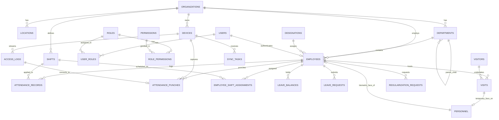

# Specification Mining & Requirements Survey Report
**Project:** Intelligent AI Camera Hub → Attendance & Visitor Management System  
**Author:** Specification Miner (`spec_miner_survey_1`)  
**Timestamp:** 2026-09-29T15:52:00Z  
**Integrity Mode:** Development  

---

## 1. Executive Summary & Spec Sources

This report synthesizes the authoritative requirements and technical specifications for transforming the **Intelligent AI Camera Hub** from a biometric camera telemetry and personnel sync platform into a comprehensive, multi-tenant enterprise **Attendance and Visitor Management System**.

### Primary Specification Sources
1. `/home/wsk-devops2/AI-Camera-Integration/.agents/teamwork/ORIGINAL_REQUEST.md` — Core user requirements, high-level domains, acceptance criteria.
2. `/home/wsk-devops2/AI-Camera-Integration/tasks.md` — Authoritative granular task checklist spanning Phase 0 through Phase 12.
3. `/home/wsk-devops2/AI-Camera-Integration/GEMINI.md` — System architecture, hardware edge camera protocols (HTTP/HTTPS Basic Auth, MQTT telemetry, JSON schemas), and existing database definitions.
4. Existing Codebase (`database/migrations`, `app/Models`, `app/Services`, `app/Console/Commands/MqttListenCommand.php`, `app/Http/Controllers/HttpWebhookController.php`).

---

## 2. Features Discovered

| # | Category | Feature | Description | Inputs | Outputs | Error Behavior | Discovered Via |
|---|----------|---------|-------------|--------|---------|----------------|----------------|
| 1 | Auth & RBAC | Sanctum User Authentication | Secure session / token-based auth for web SPA and mobile/API clients with login, logout, password reset | `email`, `password`, `remember_me` | User object, Sanctum Bearer token, session cookie | 401 Unauthorized on invalid credentials; 422 on validation failure | tasks.md §1.1, ORIGINAL_REQUEST.md §R1 |
| 2 | Auth & RBAC | Multi-Role Permission System | Dynamic RBAC with 7 core roles (`super-admin`, `admin`, `hr-manager`, `security`, `receptionist`, `manager`, `employee`) and granular permission slugs | `role_id`, `permission_id`, user context | Authorized request or UI capability flag | 403 Forbidden on missing permission | tasks.md §1.2, ORIGINAL_REQUEST.md §R1 |
| 3 | Organization | Multi-Tier Organizational Hierarchy | Model Organizations, Locations/Sites, Departments (tree hierarchy with `parent_id` and `head_id`), and Job Designations | Org metadata, timezone, department code, location coords | Hierarchy tree JSON, scoping context for devices & employees | 422 on circular parent reference; 409 on duplicate code | tasks.md §1.3, ORIGINAL_REQUEST.md §R1 |
| 4 | Employee | Employee Directory & Biometric Linkage | Comprehensive employee record linking backward-compatibly to biometric `personnel` record for face recognition | Employee details, personal/work email, dates, shift, manager, photo | Linked `Employee` + `Personnel` record; triggers camera sync | 422 on invalid foreign key or missing required fields | tasks.md §2.1-2.2, ORIGINAL_REQUEST.md §R2 |
| 5 | Shifts | Shift Definition Engine | Configurable work schedules with start/end time, grace periods, early out thresholds, half-day thresholds, break duration, flexible & overnight flags | Shift times, grace minutes, break duration, flags | Calculated shift schedule entity | 422 if end time == start time without overnight flag | tasks.md §3.1, ORIGINAL_REQUEST.md §R2 |
| 6 | Shifts | Shift Assignment & Rotation | Assign shifts to individual employees or entire departments with effective date ranges and assigned day-of-week masks | `employee_id`, `shift_id`, `effective_from`, `effective_to`, `assigned_days` | Active schedule calendar | 422 on inverted date ranges | tasks.md §3.2 |
| 7 | Shifts | Holiday Management | Public, company, and optional holidays supporting recurring rules and location/department scoping | Holiday date, name, scope JSON, recurrence flag | Holiday calendar entry | 409 on duplicate holiday date within same scope | tasks.md §3.3 |
| 8 | Attendance | Access Log to Punch Pipeline | Ingests real-time camera `AccessLog` / `VerifyPush`, detects punch direction, and creates `AttendancePunch` records | `AccessLog` model, device direction config, previous punch history | Created `AttendancePunch`, updated `AttendanceRecord` | Logs error and skips unregistered stranger records | tasks.md §4.1-4.3, ORIGINAL_REQUEST.md §R3 |
| 9 | Attendance | Attendance Metrics Computation | Calculates first clock-in, last clock-out, net work hours (minus break), late minutes, early out minutes, overtime hours, and status | `AttendancePunch[]`, assigned `Shift`, holiday/leave records | Updated `AttendanceRecord` with exact status & metrics | Gracefully defaults to present/absent on incomplete punches | tasks.md §4.3, ORIGINAL_REQUEST.md §R3 |
| 10 | Attendance | Scheduled Attendance Finalizer | End-of-day daemon batch job to mark non-clocked employees as absent, flag missing punch-outs, and finalize daily metrics | Execution date (default today) | Daily finalized roster, absence records created | Transactional rollback on database failure | tasks.md §4.4 |
| 11 | Attendance | Real-Time Attendance Broadcasting | Push live employee clock-in/out events directly to dashboard UI via Laravel Reverb WebSockets | `AttendancePunch` event | WebSocket broadcast payload to `attendance` channel | Client falls back to polling if socket disconnected | tasks.md §4.7 |
| 12 | Leaves | Leave Type & Balance Allocation | Configure leave types (paid, carry-forward, attachment required) and allocate annual quotas per employee | Leave type schema, annual quota, year | Initialized `LeaveBalance` rows | 422 on negative allocations | tasks.md §5.1, ORIGINAL_REQUEST.md §R5 |
| 13 | Leaves | Leave Request & Approval Workflow | Employees submit requests with half-day support; managers review; approved leaves update attendance records and deduct balance | `start_date`, `end_date`, `leave_type_id`, `is_half_day`, reason | `LeaveRequest` status change, balance deduction, attendance marked `on_leave` | 422 on insufficient balance or overlapping leave dates | tasks.md §5.2-5.3, ORIGINAL_REQUEST.md §R5 |
| 14 | Leaves | Annual Leave Balance Rollover | End-of-year automated carryover computation respecting max carryover day limits | Year rollover trigger, employee leave balances | Rolled over `carried_forward` balances for new year | Caps at `max_carry_forward_days` | tasks.md §5.3 |
| 15 | Visitors | Visitor Identity & Directory | Manage persistent visitor profiles with contact info, photo, company, and security watchlist/blocking controls | Visitor identity fields, ID document, photo | `Visitor` record | 403 Forbidden on checking in blocked visitor | tasks.md §6.1, 6.3, ORIGINAL_REQUEST.md §R4 |
| 16 | Visitors | Visit Lifecycle & Pre-Registration | Pre-registration by employee hosts, arrival check-in wizard, badge assignment, NDA tracking, and checkout | Host ID, purpose, expected arrival, badge number | `Visit` record, host notification event | 409 if visitor is already checked in elsewhere | tasks.md §6.2-6.3, ORIGINAL_REQUEST.md §R4 |
| 17 | Visitors | Hardware Face Provisioning & Expiry | Auto-provisions temporary face record (`temp_valid: 1`) to camera hardware on check-in; automatically revokes on checkout or expiry | Visit details, visitor photo, camera IDs | Temporary `Personnel` record synced via `camera-sync` queue | Queues retry if camera offline | tasks.md §6.4, ORIGINAL_REQUEST.md §R4, GEMINI.md |
| 18 | Notifications | Multi-Channel Alerts Engine | Centralized in-app, WebSocket, and email alerts for late clock-ins, daily absences, overrides, visitor arrivals, and stranger detections | Event trigger, recipient user, payload | Database notification, email dispatch, Reverb push | Logs failure if SMTP unavailable | tasks.md §7.1-7.3, ORIGINAL_REQUEST.md §R5 |
| 19 | Reporting | Analytics & Export Engine | Daily, monthly, department attendance reports, visitor analytics, security summaries, and CSV/XLSX/PDF generation | Report filters, date range, format (`csv`, `xlsx`, `pdf`) | Binary document download or paginated JSON analytics | 422 on invalid date range (> 365 days) | tasks.md §8.1-8.5, ORIGINAL_REQUEST.md §R5 |
| 20 | Self-Service | Employee & Manager Portals | Self-service punch log viewing, attendance regularization requests with manager approvals, and team calendar view | Regularization timestamps, reason, manager approval | Corrected `AttendanceRecord` with `source = 'regularized'` | 422 if regularization dates exceed submission window | tasks.md §9.1-9.2, ORIGINAL_REQUEST.md §R5 |
| 21 | Admin | System Settings & Audit Logging | Key-value settings repository and polymorphic audit trail tracking administrative actions and overrides | Setting key/value, model events | Updated configuration, immutable `AuditLog` entry | 403 if non-admin attempts modification | tasks.md §10.1-10.2 |
| 22 | Hardware | Device Role & Kiosk Configuration | Explicit camera roles (`entry`, `exit`, `bidirectional`, `visitor_kiosk`), location association, and self-check-in kiosk mode | `device_role`, `location_id`, kiosk settings | Directional punch routing, kiosk interface | Falls back to alternating direction if role unset | tasks.md §11.1-11.2 |
| 23 | Integration | Payroll Integration & API Docs | Monthly payroll-ready attendance aggregation API export and interactive OpenAPI / Scramble documentation | Pay period (`month`, `year`), format | Standardized payroll CSV / JSON payload; `/docs/api` portal | 404 on unclosed pay period or missing records | tasks.md §12.1-12.2 |

---

## 3. Edge Cases & Handling Matrix

| # | Feature | Input / Condition | Observed / Required Behavior |
|---|---------|-------------------|------------------------------|
| 1 | Punch Pairing | Rapid repeated scans (e.g. employee stands in front of camera and triggers 4 `VerifyPush` events in 15 seconds) | **Debounce Filter:** Punches on the same device within 60 seconds are deduplicated or treated as redundant noise. Only the first valid punch updates `first_clock_in` or sets initial punch state. |
| 2 | Punch Pairing | Camera role is `bidirectional` and employee clocks in at 09:00, then leaves at 12:00 for lunch, returns at 13:00, leaves at 18:00 | **Alternating Punch State:** Punches resolve sequentially: 09:00 (`in`), 12:00 (`out`), 13:00 (`in`), 18:00 (`out`). Daily record records `first_clock_in = 09:00`, `last_clock_out = 18:00`. |
| 3 | Shift Resolution | Overnight shift: Shift starts at 22:00 (Day 1) and ends at 07:00 (Day 2). Employee clocks in at 21:50 and clocks out at 07:10 | **Midnight Window Spanning:** Punches between 20:00 (Day 1) and 10:00 (Day 2) are mapped to the Attendance Record of **Day 1**. `total_work_hours` calculated across midnight boundary correctly. |
| 4 | Shift Resolution | Employee works on an official Public Holiday or assigned Rest Day | **Holiday Overtime / Rest-Day Presence:** Status marked as `holiday` or `rest_day`, but if clock punches exist, `total_work_hours` and `overtime_hours` are credited fully as special holiday overtime. |
| 5 | Attendance Math | Employee clocks in 20 minutes late with a 15-minute grace period on a 09:00–18:00 shift | **Grace Period Exceeded:** Because clock-in (09:20) > 09:15, `is_late = true`. `late_minutes` is measured from scheduled start: `09:20 - 09:00 = 20 minutes` (not 5 min). |
| 6 | Attendance Math | Employee clocks in at 09:00, but never clocks out before midnight | **Open Record Finalization:** `DailyAttendanceFinalizerJob` flags the record. `last_clock_out` remains null. `status = 'half_day'` or flagged with `missing_checkout = true`. HR notified or employee submits regularization. |
| 7 | Leave Deduction | Employee requests 5 days leave spanning Monday to Friday, but Wednesday is a declared national public holiday | **Non-Working Day Exclusion:** Leave deduction algorithm checks the holiday calendar; only 4 days of leave balance are deducted. |
| 8 | Leave Deduction | Employee submits half-day leave for morning (`first_half`), and clocks in at 13:30 for afternoon shift | **Half-Day Leave Pairing:** Attendance record reflects half-day leave + valid afternoon presence without marking morning late penalties. |
| 9 | Visitor Provisioning | Visitor check-in occurs while edge camera network connection is temporarily down | **Queue Resiliency:** `SyncPersonnelJob` retries up to 3 times with exponential backoff on `camera-sync` Redis queue. `sync_tasks` table records status `PENDING` -> `FAILED` with retry button on UI. |
| 10 | Visitor Expiry | Visitor leaves the premises without checking out at reception desk | **Scheduled Auto-Expiry:** `ExpireVisitorAccessJob` runs periodically, detects active visits past `valid_end` or `auto_checkout_time`, marks visit as `checked_out`, and issues `DeletePerson` to edge cameras. |
| 11 | ID Conflict | Employee and Visitor both provisioned to edge cameras | **Namespace Isolation:** `customize_id` allocations use non-overlapping ranges (e.g. Employees: `1 – 999,999`; Visitors: `1,000,000 – 1,999,999`), preventing ID collisions on camera memory. |
| 12 | Biometric Security | Person on the security Watchlist / Blocklist attempts visitor check-in or is detected by camera | **Security Alert Interception:** Check-in wizard throws 403 Forbidden. Camera detection generates immediate high-priority WebSocket alert to security room and sends alert email. |

---

## 4. Comprehensive Feature Inventory (Phases 1 through 12)

### Phase 1 — Authentication, Authorization & Multi-Tenancy
- **FEAT-01: User Authentication & Session Security (Phase 1.1)**
  - *Description:* Secure authentication using Laravel Sanctum for SPA and mobile clients. Login, logout, registration with administrative approval, password reset with token email.
  - *Requirements:* Email/password validation, CSRF cookies, Axios interceptors with 401 handling, Pinia `authStore.js` persistence.
  - *Target Models:* `User`
  - *Target Endpoints:* `POST /api/auth/login`, `POST /api/auth/logout`, `GET /api/auth/me`, `POST /api/auth/forgot-password`, `POST /api/auth/reset-password`, `PUT /api/auth/profile`
- **FEAT-02: Role-Based Access Control (RBAC) (Phase 1.2)**
  - *Description:* Hierarchical permission system supporting 7 core roles (`super-admin`, `admin`, `hr-manager`, `security`, `receptionist`, `manager`, `employee`) and module permissions.
  - *Requirements:* Middleware authorization (`can:permission_slug`), frontend permission directives (`v-can`), role and permission seeding.
  - *Target Models:* `Role`, `Permission`, `RolePermission`, `UserRole`
  - *Target Endpoints:* `GET /api/roles`, `POST /api/roles`, `PUT /api/roles/{id}`, `GET /api/permissions`, `POST /api/users/{id}/roles`
- **FEAT-03: Organizational Hierarchy & Multi-Tenancy (Phase 1.3)**
  - *Description:* Multi-tenant organizational data modeling spanning Organizations, Locations/Sites, recursive Departments (`parent_id`), and Job Designations.
  - *Requirements:* Scoping of employees and devices by location and department; department head assignment.
  - *Target Models:* `Organization`, `Location`, `Department`, `Designation`
  - *Target Endpoints:* `apiResource('organizations')`, `apiResource('locations')`, `apiResource('departments')`, `apiResource('designations')`

### Phase 2 — Employee Management (Extending Personnel)
- **FEAT-04: Employee Core Entity & Biometric Linkage (Phase 2.1)**
  - *Description:* Rich HR employee profile linked backward-compatibly to `personnel.id` (face biometric record). Preserves all existing camera sync capabilities.
  - *Requirements:* Unique `employee_code`, employment status (`active`, `on_leave`, `suspended`, `terminated`, `resigned`), reporting manager self-relation, soft-deletes.
  - *Target Models:* `Employee`, `Personnel`
  - *Target Endpoints:* `GET /api/employees`, `POST /api/employees`, `GET /api/employees/{id}`, `PUT /api/employees/{id}`, `DELETE /api/employees/{id}`
- **FEAT-05: Employee Batch Onboarding & Export (Phase 2.2)**
  - *Description:* Bulk onboarding of employee rosters via CSV/Excel and export of filtered employee lists.
  - *Requirements:* Column validation, automated `customize_id` generation, optional placeholder personnel creation.
  - *Target Models:* `Employee`
  - *Target Endpoints:* `POST /api/employees/import`, `GET /api/employees/export`, `GET /api/employees/{id}/attendance-summary`
- **FEAT-06: Employee Directory & Profile UI (Phase 2.3)**
  - *Description:* High-density Vue 3 employee management interface with search, filters, department trees, and comprehensive profile modal tabs.
  - *Target UI Components:* `EmployeeDirectory.vue`, `EmployeeProfileModal.vue`, `EmployeeFormModal.vue`

### Phase 3 — Shift & Schedule Management
- **FEAT-07: Flexible Shift Engine (Phase 3.1)**
  - *Description:* Parameterized work shifts supporting fixed hours, flexible schedules, overnight shifts crossing midnight, grace periods, early out thresholds, and break durations.
  - *Requirements:* Time validation, overnight duration calculation, color tagging for calendars.
  - *Target Models:* `Shift`
  - *Target Endpoints:* `GET /api/shifts`, `POST /api/shifts`, `PUT /api/shifts/{id}`, `DELETE /api/shifts/{id}`
- **FEAT-08: Shift Assignment & Calendar Scheduling (Phase 3.2)**
  - *Description:* Assign shifts to employees or entire departments with effective date windows and weekday bitmasks/arrays.
  - *Requirements:* Rotation support, future-dated schedule changes, bulk department assignment.
  - *Target Models:* `EmployeeShiftAssignment`
  - *Target Endpoints:* `POST /api/employees/{id}/shift-assignments`, `POST /api/shifts/bulk-assign`, `GET /api/employees/{id}/schedule`
- **FEAT-09: Holiday Calendar Management (Phase 3.3)**
  - *Description:* Multi-calendar holiday system supporting public, company, and optional holidays, annual recurrence, and location/department scoping.
  - *Target Models:* `Holiday`
  - *Target Endpoints:* `GET /api/holidays`, `POST /api/holidays`, `PUT /api/holidays/{id}`, `DELETE /api/holidays/{id}`
- **FEAT-10: Schedule & Calendar UI (Phase 3.4)**
  - *Description:* Interactive UI for shift design, visual calendar drag-and-drop or batch assignment, and holiday calendar management.
  - *Target UI Components:* `ShiftManager.vue`, `ShiftAssignment.vue`, `HolidayCalendar.vue`

### Phase 4 — Attendance Processing Engine
- **FEAT-11: Attendance Punch Log Ingestion (Phase 4.1 & 4.2)**
  - *Description:* Consumes camera `AccessLog` / `VerifyPush` events and maps them to `AttendancePunch` records linked to employees via `customize_id`.
  - *Requirements:* Direction resolution (`in` vs `out`) based on device role or alternating punch state; 60s debounce window.
  - *Target Models:* `AttendancePunch`, `AccessLog`, `Device`
  - *Target Endpoints:* `GET /api/attendance/punches`
- **FEAT-12: Real-Time Attendance Record Upsert & Metrics Calculation (Phase 4.3)**
  - *Description:* Core mathematical evaluation updating daily `AttendanceRecord`: `first_clock_in`, `last_clock_out`, `total_work_hours`, `late_minutes`, `early_out_minutes`, `overtime_hours`, and calculated `status`.
  - *Requirements:* Shift resolution with grace period and break deduction, unique composite key `(employee_id, date)`.
  - *Target Models:* `AttendanceRecord`, `Shift`
  - *Target Endpoints:* `GET /api/attendance/daily`, `GET /api/attendance/employee/{id}`, `GET /api/attendance/summary`
- **FEAT-13: Scheduled Daily Finalizer & Reconciliation Daemon (Phase 4.4)**
  - *Description:* Nightly scheduled batch job (`DailyAttendanceFinalizerJob`) that processes absent employees, handles open/incomplete punches, and computes final overtime.
  - *Requirements:* Runs at 23:59 daily via Laravel scheduler; handles employees with zero punches on working days.
  - *Target Commands/Jobs:* `DailyAttendanceFinalizerJob`, `MonthlyAttendanceSummaryJob`, `ProcessAttendancePunchJob`
- **FEAT-14: HR Manual Overrides & Attendance Regularization (Phase 4.5)**
  - *Description:* Administrative endpoints allowing HR to insert manual clock-ins/outs or override attendance statuses with audit remarks.
  - *Target Models:* `AttendanceRecord`, `AttendancePunch`
  - *Target Endpoints:* `POST /api/attendance/manual-entry`, `PUT /api/attendance/{id}/override`
- **FEAT-15: Real-Time Attendance Dashboard & UI (Phase 4.6 & 4.7)**
  - *Description:* Live monitoring dashboard with "Who's In / Who's Out", late arrival ticker, department stats bars, and Reverb WebSocket live updates.
  - *Target UI Components:* `AttendanceDashboard.vue`, `DailyAttendanceRoster.vue`, `EmployeeAttendanceCalendar.vue`, `ManualAttendanceEntry.vue`

### Phase 5 — Leave Management
- **FEAT-16: Leave Policy & Balance Quotas (Phase 5.1)**
  - *Description:* Definition of leave types (paid/unpaid, carry-forward rules, attachment mandates) and employee annual balance allocations.
  - *Target Models:* `LeaveType`, `LeaveBalance`
  - *Target Endpoints:* `apiResource('leave-types')`, `GET /api/leave-balances`, `POST /api/leave-balances/allocate`, `PUT /api/leave-balances/{id}/adjust`
- **FEAT-17: Leave Application & Multi-Level Approval (Phase 5.2 & 5.3)**
  - *Description:* Submission of leave requests (full-day or half-day), manager review and approval/rejection. Automatically deducts balances and updates attendance records to `on_leave`.
  - *Requirements:* Overlap checks, balance sufficiency checks, non-working day exclusions, balance restoration on cancellation.
  - *Target Models:* `LeaveRequest`, `LeaveBalance`, `AttendanceRecord`
  - *Target Endpoints:* `POST /api/leave-requests`, `GET /api/leave-requests`, `PUT /api/leave-requests/{id}/approve`, `PUT /api/leave-requests/{id}/reject`, `PUT /api/leave-requests/{id}/cancel`
- **FEAT-18: Annual Carryover Rollover Job (Phase 5.3)**
  - *Description:* Automated year-end rollover job that calculates unused balances, applies carryover caps, and creates next year's balances.
  - *Target Jobs/Commands:* `AnnualLeaveRolloverCommand`
- **FEAT-19: Leave Management UI (Phase 5.4)**
  - *Description:* Interactive leave request modal, manager approval queue, personal balance summary cards, and team leave calendar.
  - *Target UI Components:* `LeaveRequestForm.vue`, `LeaveApprovalQueue.vue`, `LeaveBalanceWidget.vue`, `LeaveCalendarView.vue`

### Phase 6 — Comprehensive Visitor Management Lifecycle
- **FEAT-20: Visitor Directory & Watchlist (Phase 6.1 & 6.3)**
  - *Description:* Persistent directory of visitors with contact information, identity documents, facial photos, and security blocklist flags with reasons.
  - *Target Models:* `Visitor`
  - *Target Endpoints:* `GET /api/visitors`, `POST /api/visitors`, `GET /api/visitors/{id}`, `PUT /api/visitors/{id}`, `POST /api/visitors/{id}/block`
- **FEAT-21: Host Pre-Registration & Visitor Invitation (Phase 6.2)**
  - *Description:* Employee hosts pre-register expected visitors; system generates invitation tokens, QR codes, and expected visit rosters.
  - *Target Models:* `Visit`
  - *Target Endpoints:* `POST /api/visits/pre-register`, `GET /api/visits/expected`, `POST /api/visits/{id}/cancel`
- **FEAT-22: Reception Check-In Wizard & Badge Generation (Phase 6.3)**
  - *Description:* Multi-step check-in wizard at reception: visitor lookup or creation, photo capture, host selection, NDA agreement signature, badge assignment, and host arrival notification.
  - *Target Models:* `Visit`
  - *Target Endpoints:* `POST /api/visits`, `PUT /api/visits/{id}/check-in`, `PUT /api/visits/{id}/check-out`, `GET /api/visits/active`
- **FEAT-23: Automated Hardware Face Sync & Expiry (Phase 6.4)**
  - *Description:* Synchronizes visitor photo to camera hardware as temporary whitelist personnel (`temp_valid: 1`, `valid_begin`, `valid_end`) on check-in. Automatically revokes (`DeletePerson`) on checkout or end of day via `ExpireVisitorAccessJob`.
  - *Requirements:* Dispatches via `camera-sync` queue; handles offline camera queues; logs temporary visits.
  - *Target Services/Jobs:* `VisitorSyncService`, `ExpireVisitorAccessJob`, `SyncPersonnelJob`
- **FEAT-24: Visitor Management UI & Badge Print (Phase 6.5)**
  - *Description:* Receptionist dashboard, check-in wizard, fast checkout modal, printable visitor badge template, and watchlist manager.
  - *Target UI Components:* `VisitorDashboard.vue`, `VisitorCheckInWizard.vue`, `VisitorCheckOutModal.vue`, `VisitorDirectory.vue`, `VisitorPreRegisterForm.vue`, `VisitorBadge.vue`, `WatchlistManager.vue`

### Phase 7 — Notifications & Alerts Engine
- **FEAT-25: Multi-Channel Notification Infrastructure (Phase 7.1)**
  - *Description:* Unified notification routing across database (in-app), Laravel Reverb (real-time WebSocket push), and SMTP Email.
  - *Target Models:* `Notification`, `NotificationPreference`
  - *Target Endpoints:* `GET /api/notifications`, `POST /api/notifications/{id}/read`, `POST /api/notifications/read-all`, `GET /api/notifications/preferences`, `PUT /api/notifications/preferences`
- **FEAT-26: Automated Operational & Security Alert Triggers (Phase 7.2 & 7.3)**
  - *Description:* Automatic event dispatch on late clock-ins, daily team absences, leave approvals, visitor arrivals, and blocked person / stranger detection alerts.
  - *Target Events/Notifications:* `VisitorArrivedNotification`, `LateArrivalNotification`, `SecurityAlertNotification`, `LeaveStatusChangedNotification`
  - *Target UI Components:* `NotificationBell.vue`, `NotificationsPage.vue`

### Phase 8 — Reporting & Analytics
- **FEAT-27: Attendance & Tardiness Analytics (Phase 8.1)**
  - *Description:* Aggregated reporting: daily department rosters, monthly employee summaries, tardiness rankings, overtime hours, and average work hours.
  - *Target Endpoints:* `GET /api/reports/attendance/daily`, `GET /api/reports/attendance/monthly`, `GET /api/reports/attendance/department`, `GET /api/reports/attendance/tardiness`, `GET /api/reports/attendance/overtime`
- **FEAT-28: Visitor & Security Analytics (Phase 8.2 & 8.3)**
  - *Description:* Visitor traffic metrics (duration, purpose breakdown, top hosts) and security reports (stranger detections, denied verifications, device uptime).
  - *Target Endpoints:* `GET /api/reports/visitors/summary`, `GET /api/reports/security/strangers`, `GET /api/reports/security/denied`
- **FEAT-29: Multi-Format Report Exporter (Phase 8.4 & 8.5)**
  - *Description:* Export any report into standard CSV, Excel (.xlsx), or formatted PDF with date filters and department scoping.
  - *Target Endpoints:* `GET /api/reports/export?type=&format=csv|xlsx|pdf`
  - *Target UI Components:* `ReportsPage.vue` (with interactive charts)

### Phase 9 — Attendance Self-Service (Employee Portal)
- **FEAT-30: Employee Self-Service Hub (Phase 9.1)**
  - *Description:* Employee portal for viewing personal monthly attendance calendars, raw punch logs, leave balances, and profile settings.
  - *Target UI Components:* `MyAttendance.vue`, `MyPunches.vue`, `MyLeaveBalances.vue`
- **FEAT-31: Attendance Regularization Requests (Phase 9.1 & 9.2)**
  - *Description:* Employees submit correction requests for missed or erroneous clock punches; managers review and approve/reject with automatic record adjustment.
  - *Target Models:* `RegularizationRequest`
  - *Target Endpoints:* `POST /api/regularization-requests`, `GET /api/regularization-requests`, `PUT /api/regularization-requests/{id}/approve`, `PUT /api/regularization-requests/{id}/reject`
- **FEAT-32: Manager Oversight & Approval Queue (Phase 9.2)**
  - *Description:* Dedicated dashboard for managers showing team presence, pending leave requests, and pending punch regularizations.
  - *Target UI Components:* `ManagerTeamDashboard.vue`, `ApprovalQueueModal.vue`

### Phase 10 — System Configuration & Administration
- **FEAT-33: Global System Settings Management (Phase 10.1)**
  - *Description:* Configurable key-value repository for system-wide and organization-specific parameters (grace periods, overtime thresholds, visitor policies, notification toggles).
  - *Target Models:* `Setting`
  - *Target Endpoints:* `GET /api/settings`, `POST /api/settings`, `PUT /api/settings/bulk`
  - *Target UI Components:* `SystemSettings.vue`
- **FEAT-34: Comprehensive Audit Trail (Phase 10.2)**
  - *Description:* Polymorphic audit logging recording all administrative updates, overrides, approvals, and deletions with actor, IP, timestamp, and diff JSON.
  - *Target Models:* `AuditLog`
  - *Target Endpoints:* `GET /api/audit-logs`
  - *Target UI Components:* `AuditLogViewer.vue`
- **FEAT-35: Data Retention & System Health Monitoring (Phase 10.3)**
  - *Description:* Automated pruning/archival of historical access logs and real-time health dashboard for Redis, PostgreSQL, MQTT broker, and Reverb daemons.
  - *Target Commands/Endpoints:* `GET /api/system/health`, `artisan access-logs:prune`

### Phase 11 — Device Enhancements for Attendance & Visitors
- **FEAT-36: Device Role & Directional Configuration (Phase 11.1)**
  - *Description:* Extend `devices` table with `device_role` (`entry`, `exit`, `bidirectional`, `visitor_kiosk`), `location_id`, and `department_ids` JSON scoping.
  - *Requirements:* Integrated into punch direction determination algorithm.
  - *Target Models:* `Device`
  - *Target Endpoints:* Updated `POST /api/devices`, `PUT /api/devices/{id}`
- **FEAT-37: Visitor Self-Service Kiosk Mode (Phase 11.2)**
  - *Description:* Full-screen responsive kiosk interface for unattended reception desks: QR check-in, camera face scanning, and automatic badge printing.
  - *Target UI Components:* `VisitorKioskView.vue`

### Phase 12 — Integration & API Documentation
- **FEAT-38: Standardized Payroll Data Export (Phase 12.1)**
  - *Description:* Payroll integration export endpoint providing employee code, worked hours, overtime hours, absences, late counts, and leave hours in configurable CSV or JSON formats.
  - *Target Endpoints:* `GET /api/payroll/export?month=&year=&format=csv|json`
- **FEAT-39: Interactive API Documentation (Phase 12.2)**
  - *Description:* Auto-generated OpenAPI / Swagger specification and interactive documentation hosted at `/docs/api` using Scramble or Scribe.
- **FEAT-40: Mobile Responsiveness & PWA Support (Phase 12.3)**
  - *Description:* Mobile viewport optimizations across all views, service worker caching, and web app manifest for home-screen installation.

---

## 5. Complete Entity Schemas & Relationship Model

The database architecture is designed for **PostgreSQL 16+**. It preserves all existing camera integration tables while layering organizational, HR, attendance, leave, visitor, notification, and governance domains with strict foreign keys, cascading rules, and optimized indexes.



### Table 1: `organizations`
| Column | Type | Constraints / Attributes | Description |
|---|---|---|---|
| `id` | BIGSERIAL | PRIMARY KEY | Unique organization ID |
| `name` | VARCHAR(128) | NOT NULL | Organization / Company legal name |
| `code` | VARCHAR(32) | UNIQUE, NOT NULL | Organization short code (e.g. `CORP01`) |
| `logo` | VARCHAR(255) | NULLABLE | Storage path or URL to logo |
| `address` | VARCHAR(255) | NULLABLE | Headquarters physical address |
| `timezone` | VARCHAR(64) | DEFAULT `'UTC'`, NOT NULL | Default time zone (e.g. `'Asia/Singapore'`) |
| `settings` | JSONB | DEFAULT `'{}'`, NOT NULL | Organization-scoped policy configurations |
| `created_at` | TIMESTAMPTZ | DEFAULT CURRENT_TIMESTAMP | Record creation timestamp |
| `updated_at` | TIMESTAMPTZ | DEFAULT CURRENT_TIMESTAMP | Record last updated timestamp |

### Table 2: `locations`
| Column | Type | Constraints / Attributes | Description |
|---|---|---|---|
| `id` | BIGSERIAL | PRIMARY KEY | Unique location ID |
| `organization_id` | BIGINT | NOT NULL, FK -> `organizations(id)` ON DELETE CASCADE | Parent organization |
| `name` | VARCHAR(128) | NOT NULL | Site / Branch / Office name (e.g. `'Building A'`) |
| `code` | VARCHAR(32) | NULLABLE | Location code |
| `address` | VARCHAR(255) | NULLABLE | Physical site address |
| `timezone` | VARCHAR(64) | DEFAULT `'UTC'`, NOT NULL | Local timezone of physical site |
| `coordinates` | VARCHAR(64) | NULLABLE | Latitude, Longitude (e.g. `'1.3521,103.8198'`) |
| `created_at` | TIMESTAMPTZ | DEFAULT CURRENT_TIMESTAMP | Creation timestamp |
| `updated_at` | TIMESTAMPTZ | DEFAULT CURRENT_TIMESTAMP | Last update timestamp |

### Table 3: `departments`
| Column | Type | Constraints / Attributes | Description |
|---|---|---|---|
| `id` | BIGSERIAL | PRIMARY KEY | Unique department ID |
| `organization_id` | BIGINT | NOT NULL, FK -> `organizations(id)` ON DELETE CASCADE | Parent organization |
| `parent_id` | BIGINT | NULLABLE, FK -> `departments(id)` ON DELETE SET NULL | Parent department for recursive hierarchy |
| `head_id` | BIGINT | NULLABLE, FK -> `employees(id)` ON DELETE SET NULL | Department manager / head of department |
| `name` | VARCHAR(128) | NOT NULL | Department name (e.g. `'Engineering'`) |
| `code` | VARCHAR(32) | NOT NULL | Department code (e.g. `'ENG'`) |
| `created_at` | TIMESTAMPTZ | DEFAULT CURRENT_TIMESTAMP | Creation timestamp |
| `updated_at` | TIMESTAMPTZ | DEFAULT CURRENT_TIMESTAMP | Last update timestamp |

### Table 4: `designations`
| Column | Type | Constraints / Attributes | Description |
|---|---|---|---|
| `id` | BIGSERIAL | PRIMARY KEY | Unique designation ID |
| `organization_id` | BIGINT | NOT NULL, FK -> `organizations(id)` ON DELETE CASCADE | Parent organization |
| `name` | VARCHAR(128) | NOT NULL | Job title / designation name (e.g. `'Senior DevOps'`) |
| `level` | INT | DEFAULT 1, NOT NULL | Seniority / hierarchical grade level |
| `created_at` | TIMESTAMPTZ | DEFAULT CURRENT_TIMESTAMP | Creation timestamp |
| `updated_at` | TIMESTAMPTZ | DEFAULT CURRENT_TIMESTAMP | Last update timestamp |

### Table 5: `roles`, `permissions`, `role_permission`, `user_role`
- **`roles`**: `id` (BIGSERIAL), `name` (VARCHAR 64), `slug` (VARCHAR 64, UNIQUE), `description` (TEXT), `created_at`, `updated_at`.
- **`permissions`**: `id` (BIGSERIAL), `name` (VARCHAR 128), `slug` (VARCHAR 64, UNIQUE), `group` (VARCHAR 64), `created_at`, `updated_at`.
- **`role_permission`**: `role_id` (BIGINT FK -> `roles(id)` ON DELETE CASCADE), `permission_id` (BIGINT FK -> `permissions(id)` ON DELETE CASCADE), PRIMARY KEY (`role_id`, `permission_id`).
- **`user_role`**: `user_id` (BIGINT FK -> `users(id)` ON DELETE CASCADE), `role_id` (BIGINT FK -> `roles(id)` ON DELETE CASCADE), PRIMARY KEY (`user_id`, `role_id`).

### Table 6: `employees`
| Column | Type | Constraints / Attributes | Description |
|---|---|---|---|
| `id` | BIGSERIAL | PRIMARY KEY | Unique employee record ID |
| `personnel_id` | BIGINT | UNIQUE, NULLABLE, FK -> `personnel(id)` ON DELETE SET NULL | Biometric face linkage to existing camera personnel |
| `employee_code` | VARCHAR(64) | UNIQUE, NOT NULL, INDEX | Unique employee / badge number (e.g. `'EMP-1001'`) |
| `organization_id` | BIGINT | NOT NULL, FK -> `organizations(id)` ON DELETE CASCADE | Employing organization |
| `department_id` | BIGINT | NULLABLE, FK -> `departments(id)` ON DELETE SET NULL | Assigned department |
| `designation_id` | BIGINT | NULLABLE, FK -> `designations(id)` ON DELETE SET NULL | Assigned job title |
| `location_id` | BIGINT | NULLABLE, FK -> `locations(id)` ON DELETE SET NULL | Primary office / site location |
| `reporting_manager_id` | BIGINT | NULLABLE, FK -> `employees(id)` ON DELETE SET NULL | Direct supervisor / manager |
| `user_id` | BIGINT | UNIQUE, NULLABLE, FK -> `users(id)` ON DELETE SET NULL | Linked login account for self-service portal |
| `first_name` | VARCHAR(64) | NOT NULL | First name |
| `last_name` | VARCHAR(64) | NOT NULL | Last name |
| `gender` | SMALLINT | DEFAULT 0 | 0: Male, 1: Female, 2: Other |
| `phone` | VARCHAR(32) | NULLABLE | Contact telephone |
| `personal_email` | VARCHAR(128) | NULLABLE | Personal email address |
| `work_email` | VARCHAR(128) | UNIQUE, NULLABLE | Official corporate email |
| `employment_type` | VARCHAR(32) | DEFAULT `'full_time'` | `'full_time'`, `'part_time'`, `'contract'`, `'intern'` |
| `employment_status` | VARCHAR(32) | DEFAULT `'active'` | `'active'`, `'on_leave'`, `'suspended'`, `'terminated'`, `'resigned'` |
| `date_of_joining` | DATE | NOT NULL | Date hired |
| `date_of_leaving` | DATE | NULLABLE | Termination / resignation date |
| `emergency_contact_name` | VARCHAR(128) | NULLABLE | Emergency contact person |
| `emergency_contact_phone` | VARCHAR(32) | NULLABLE | Emergency contact phone number |
| `shift_id` | BIGINT | NULLABLE, FK -> `shifts(id)` ON DELETE SET NULL | Default assigned work shift |
| `created_at` | TIMESTAMPTZ | DEFAULT CURRENT_TIMESTAMP | Creation timestamp |
| `updated_at` | TIMESTAMPTZ | DEFAULT CURRENT_TIMESTAMP | Last update timestamp |
| `deleted_at` | TIMESTAMPTZ | NULLABLE | Soft delete timestamp |

### Table 7: `shifts`
| Column | Type | Constraints / Attributes | Description |
|---|---|---|---|
| `id` | BIGSERIAL | PRIMARY KEY | Unique shift ID |
| `organization_id` | BIGINT | NOT NULL, FK -> `organizations(id)` ON DELETE CASCADE | Owning organization |
| `name` | VARCHAR(128) | NOT NULL | Shift display name (e.g. `'Standard Day Shift'`) |
| `code` | VARCHAR(32) | NOT NULL | Shift code (e.g. `'SHIFT-DAY'`) |
| `shift_start` | TIME | NOT NULL | Scheduled start time (e.g. `'09:00:00'`) |
| `shift_end` | TIME | NOT NULL | Scheduled end time (e.g. `'18:00:00'`) |
| `grace_period_minutes` | INT | DEFAULT 15, NOT NULL | Late tolerance window in minutes |
| `early_out_threshold_minutes` | INT | DEFAULT 30, NOT NULL | Leaving prior to `end - threshold` triggers early out |
| `half_day_threshold_hours` | NUMERIC(4,2) | DEFAULT 4.00, NOT NULL | Hours worked below this value marks half-day |
| `min_hours_full_day` | NUMERIC(4,2) | DEFAULT 8.00, NOT NULL | Minimum net hours required for full day presence |
| `is_overnight` | BOOLEAN | DEFAULT FALSE, NOT NULL | Indicates shift crosses midnight boundary |
| `break_duration_minutes` | INT | DEFAULT 60, NOT NULL | Unpaid break duration deducted from gross work time |
| `is_flexible` | BOOLEAN | DEFAULT FALSE, NOT NULL | Flexible hours mode (ignores fixed start/end times) |
| `color` | VARCHAR(16) | DEFAULT `'#3B82F6'` | Hex color code for calendar visualization |
| `is_active` | BOOLEAN | DEFAULT TRUE, NOT NULL | Active status toggle |
| `created_at` | TIMESTAMPTZ | DEFAULT CURRENT_TIMESTAMP | Creation timestamp |
| `updated_at` | TIMESTAMPTZ | DEFAULT CURRENT_TIMESTAMP | Last update timestamp |

### Table 8: `employee_shift_assignments`
| Column | Type | Constraints / Attributes | Description |
|---|---|---|---|
| `id` | BIGSERIAL | PRIMARY KEY | Unique assignment ID |
| `employee_id` | BIGINT | NOT NULL, FK -> `employees(id)` ON DELETE CASCADE | Assigned employee |
| `shift_id` | BIGINT | NOT NULL, FK -> `shifts(id)` ON DELETE CASCADE | Assigned shift |
| `effective_from` | DATE | NOT NULL | Start date of schedule validity |
| `effective_to` | DATE | NULLABLE | End date of schedule validity (null = indefinite) |
| `assigned_days` | JSONB | NOT NULL | Array of active weekdays (e.g. `[1,2,3,4,5]` Mon-Fri) |
| `created_by` | BIGINT | NULLABLE, FK -> `users(id)` ON DELETE SET NULL | User who assigned schedule |
| `created_at` | TIMESTAMPTZ | DEFAULT CURRENT_TIMESTAMP | Creation timestamp |
| `updated_at` | TIMESTAMPTZ | DEFAULT CURRENT_TIMESTAMP | Last update timestamp |

### Table 9: `holidays`
| Column | Type | Constraints / Attributes | Description |
|---|---|---|---|
| `id` | BIGSERIAL | PRIMARY KEY | Unique holiday ID |
| `organization_id` | BIGINT | NOT NULL, FK -> `organizations(id)` ON DELETE CASCADE | Parent organization |
| `name` | VARCHAR(128) | NOT NULL | Holiday title (e.g. `'New Year's Day'`) |
| `date` | DATE | NOT NULL, INDEX | Calendar date of holiday |
| `type` | VARCHAR(32) | DEFAULT `'public'` | `'public'`, `'company'`, `'optional'` |
| `is_recurring` | BOOLEAN | DEFAULT FALSE | Automatically recurs on the same date annually |
| `applies_to` | JSONB | NULLABLE | Filter: specific locations or department IDs (null = all) |
| `created_at` | TIMESTAMPTZ | DEFAULT CURRENT_TIMESTAMP | Creation timestamp |
| `updated_at` | TIMESTAMPTZ | DEFAULT CURRENT_TIMESTAMP | Last update timestamp |

### Table 10: `attendance_punches` (Raw Clock Events)
| Column | Type | Constraints / Attributes | Description |
|---|---|---|---|
| `id` | BIGSERIAL | PRIMARY KEY | Unique punch ID |
| `employee_id` | BIGINT | NOT NULL, FK -> `employees(id)` ON DELETE CASCADE | Employee who punched |
| `access_log_id` | BIGINT | NULLABLE, FK -> `access_logs(id)` ON DELETE SET NULL | Link to original camera verification log |
| `device_id` | VARCHAR(64) | NULLABLE, FK -> `devices(device_id)` ON DELETE SET NULL | Camera device capturing punch |
| `punch_time` | TIMESTAMPTZ | NOT NULL, INDEX | Timestamp of clock event |
| `direction` | VARCHAR(16) | NOT NULL | `'in'`, `'out'`, `'unknown'` |
| `source` | VARCHAR(32) | DEFAULT `'camera_auto'` | `'camera_auto'`, `'manual'`, `'kiosk'`, `'mobile'` |
| `location_id` | BIGINT | NULLABLE, FK -> `locations(id)` ON DELETE SET NULL | Site location where punch occurred |
| `created_at` | TIMESTAMPTZ | DEFAULT CURRENT_TIMESTAMP | System receipt timestamp |

### Table 11: `attendance_records` (Computed Daily Attendance)
| Column | Type | Constraints / Attributes | Description |
|---|---|---|---|
| `id` | BIGSERIAL | PRIMARY KEY | Unique daily attendance record ID |
| `employee_id` | BIGINT | NOT NULL, FK -> `employees(id)` ON DELETE CASCADE | Employee |
| `date` | DATE | NOT NULL, INDEX | Attendance calendar date |
| `shift_id` | BIGINT | NULLABLE, FK -> `shifts(id)` ON DELETE SET NULL | Shift active for employee on this date |
| `first_clock_in` | TIMESTAMPTZ | NULLABLE | Earliest clock-in timestamp |
| `last_clock_out` | TIMESTAMPTZ | NULLABLE | Latest clock-out timestamp |
| `total_work_hours` | NUMERIC(5,2) | DEFAULT 0.00, NOT NULL | Computed net work duration in decimal hours |
| `overtime_hours` | NUMERIC(5,2) | DEFAULT 0.00, NOT NULL | Approved overtime hours |
| `status` | VARCHAR(32) | NOT NULL, INDEX | `'present'`, `'absent'`, `'late'`, `'early_out'`, `'late_and_early_out'`, `'half_day'`, `'on_leave'`, `'holiday'`, `'weekend'`, `'rest_day'` |
| `is_late` | BOOLEAN | DEFAULT FALSE, NOT NULL | Flag indicating late arrival |
| `late_minutes` | INT | DEFAULT 0, NOT NULL | Total minutes late past scheduled start |
| `is_early_out` | BOOLEAN | DEFAULT FALSE, NOT NULL | Flag indicating early departure |
| `early_out_minutes` | INT | DEFAULT 0, NOT NULL | Total minutes departed prior to scheduled end |
| `source` | VARCHAR(32) | DEFAULT `'auto'` | `'auto'`, `'manual'`, `'regularized'` |
| `remarks` | TEXT | NULLABLE | Audit / HR explanatory notes |
| `created_at` | TIMESTAMPTZ | DEFAULT CURRENT_TIMESTAMP | Creation timestamp |
| `updated_at` | TIMESTAMPTZ | DEFAULT CURRENT_TIMESTAMP | Last update timestamp |
| *Index* | UNIQUE | `UNIQUE (employee_id, date)` | Ensures exactly one summary record per employee per day |

### Table 12: `leave_types`
| Column | Type | Constraints / Attributes | Description |
|---|---|---|---|
| `id` | BIGSERIAL | PRIMARY KEY | Unique leave type ID |
| `organization_id` | BIGINT | NOT NULL, FK -> `organizations(id)` ON DELETE CASCADE | Parent organization |
| `name` | VARCHAR(64) | NOT NULL | Leave type name (e.g. `'Vacation Leave'`, `'Sick Leave'`) |
| `code` | VARCHAR(32) | NOT NULL | Unique code (e.g. `'VAC'`, `'SICK'`) |
| `max_days_per_year` | NUMERIC(4,1) | NOT NULL | Standard annual entitlement in days |
| `is_paid` | BOOLEAN | DEFAULT TRUE | Paid vs unpaid leave |
| `is_carry_forward` | BOOLEAN | DEFAULT FALSE | Enables annual balance carryover |
| `max_carry_forward_days` | NUMERIC(4,1) | DEFAULT 0.0 | Maximum unused days allowed to roll over |
| `requires_attachment` | BOOLEAN | DEFAULT FALSE | Requires medical slip or supporting document |
| `color` | VARCHAR(16) | DEFAULT `'#10B981'` | Color code for calendar widgets |
| `is_active` | BOOLEAN | DEFAULT TRUE | Active status |
| `created_at` | TIMESTAMPTZ | DEFAULT CURRENT_TIMESTAMP | Creation timestamp |
| `updated_at` | TIMESTAMPTZ | DEFAULT CURRENT_TIMESTAMP | Last update timestamp |

### Table 13: `leave_balances`
| Column | Type | Constraints / Attributes | Description |
|---|---|---|---|
| `id` | BIGSERIAL | PRIMARY KEY | Unique balance entry ID |
| `employee_id` | BIGINT | NOT NULL, FK -> `employees(id)` ON DELETE CASCADE | Employee |
| `leave_type_id` | BIGINT | NOT NULL, FK -> `leave_types(id)` ON DELETE CASCADE | Associated leave type |
| `year` | INT | NOT NULL | Calendar / fiscal year (e.g. `2026`) |
| `allocated` | NUMERIC(4,1) | DEFAULT 0.0, NOT NULL | Standard quota allocated for year |
| `carried_forward` | NUMERIC(4,1) | DEFAULT 0.0, NOT NULL | Balance rolled over from previous year |
| `used` | NUMERIC(4,1) | DEFAULT 0.0, NOT NULL | Total days consumed by approved leaves |
| `remaining` | NUMERIC(4,1) | GENERATED ALWAYS AS (`allocated + carried_forward - used`) STORED | Unused remaining days |
| `created_at` | TIMESTAMPTZ | DEFAULT CURRENT_TIMESTAMP | Creation timestamp |
| `updated_at` | TIMESTAMPTZ | DEFAULT CURRENT_TIMESTAMP | Last update timestamp |
| *Index* | UNIQUE | `UNIQUE (employee_id, leave_type_id, year)` | Prevents duplicate balance records |

### Table 14: `leave_requests`
| Column | Type | Constraints / Attributes | Description |
|---|---|---|---|
| `id` | BIGSERIAL | PRIMARY KEY | Unique leave request ID |
| `employee_id` | BIGINT | NOT NULL, FK -> `employees(id)` ON DELETE CASCADE | Requesting employee |
| `leave_type_id` | BIGINT | NOT NULL, FK -> `leave_types(id)` ON DELETE CASCADE | Requested leave type |
| `start_date` | DATE | NOT NULL | First day of leave |
| `end_date` | DATE | NOT NULL | Last day of leave |
| `total_days` | NUMERIC(4,1) | NOT NULL | Total working days requested (e.g. `0.5`, `3.0`) |
| `is_half_day` | BOOLEAN | DEFAULT FALSE | Half-day leave flag |
| `half_day_period` | VARCHAR(16) | NULLABLE | `'first_half'` (morning) or `'second_half'` (afternoon) |
| `reason` | TEXT | NOT NULL | Justification submitted by employee |
| `attachment_path` | VARCHAR(255) | NULLABLE | Storage path for medical slip or document |
| `status` | VARCHAR(20) | DEFAULT `'pending'`, INDEX | `'pending'`, `'approved'`, `'rejected'`, `'cancelled'` |
| `approved_by` | BIGINT | NULLABLE, FK -> `users(id)` ON DELETE SET NULL | Manager/HR reviewer |
| `approved_at` | TIMESTAMPTZ | NULLABLE | Approval/rejection timestamp |
| `rejection_reason` | TEXT | NULLABLE | Reason if request is rejected |
| `created_at` | TIMESTAMPTZ | DEFAULT CURRENT_TIMESTAMP | Submission timestamp |
| `updated_at` | TIMESTAMPTZ | DEFAULT CURRENT_TIMESTAMP | Last update timestamp |

### Table 15: `visitors` (Persistent Identity)
| Column | Type | Constraints / Attributes | Description |
|---|---|---|---|
| `id` | BIGSERIAL | PRIMARY KEY | Unique visitor identity ID |
| `organization_id` | BIGINT | NOT NULL, FK -> `organizations(id)` ON DELETE CASCADE | Associated organization |
| `location_id` | BIGINT | NULLABLE, FK -> `locations(id)` ON DELETE SET NULL | Primary visited location |
| `first_name` | VARCHAR(64) | NOT NULL | Visitor first name |
| `last_name` | VARCHAR(64) | NOT NULL | Visitor last name |
| `email` | VARCHAR(128) | NULLABLE, INDEX | Visitor contact email |
| `phone` | VARCHAR(32) | NULLABLE, INDEX | Visitor phone number |
| `company` | VARCHAR(128) | NULLABLE | Visitor's employer / organization name |
| `id_type` | VARCHAR(32) | NULLABLE | `'national_id'`, `'passport'`, `'driver_license'` |
| `id_number` | VARCHAR(64) | NULLABLE | Identification number |
| `photo_path` | VARCHAR(255) | NULLABLE | Disk storage path to facial photo |
| `photo_base64` | TEXT | NULLABLE | Optional cached Base64 face representation |
| `is_blocked` | BOOLEAN | DEFAULT FALSE, INDEX | Watchlist / security blacklist flag |
| `block_reason` | TEXT | NULLABLE | Rationale for security blocking |
| `notes` | TEXT | NULLABLE | General receptionist/security notes |
| `created_at` | TIMESTAMPTZ | DEFAULT CURRENT_TIMESTAMP | Creation timestamp |
| `updated_at` | TIMESTAMPTZ | DEFAULT CURRENT_TIMESTAMP | Last update timestamp |

### Table 16: `visits` (Visit Sessions)
| Column | Type | Constraints / Attributes | Description |
|---|---|---|---|
| `id` | BIGSERIAL | PRIMARY KEY | Unique visit session ID |
| `visitor_id` | BIGINT | NOT NULL, FK -> `visitors(id)` ON DELETE CASCADE | Linked visitor identity |
| `organization_id` | BIGINT | NOT NULL, FK -> `organizations(id)` ON DELETE CASCADE | Visited organization |
| `location_id` | BIGINT | NULLABLE, FK -> `locations(id)` ON DELETE SET NULL | Visited site location |
| `host_employee_id` | BIGINT | NOT NULL, FK -> `employees(id)` ON DELETE CASCADE | Employee being visited |
| `purpose` | VARCHAR(32) | NOT NULL | `'meeting'`, `'interview'`, `'delivery'`, `'contractor'`, `'vip'`, `'other'` |
| `purpose_detail` | TEXT | NULLABLE | Specific meeting agenda / details |
| `visitor_type` | VARCHAR(32) | DEFAULT `'walk_in'` | `'walk_in'`, `'pre_registered'`, `'recurring'`, `'contractor'`, `'vip'` |
| `badge_number` | VARCHAR(64) | NULLABLE, INDEX | Physical temporary badge / RFID issued |
| `expected_arrival` | TIMESTAMPTZ | NULLABLE | Anticipated arrival timestamp (pre-registration) |
| `check_in_at` | TIMESTAMPTZ | NULLABLE, INDEX | Actual check-in timestamp |
| `check_out_at` | TIMESTAMPTZ | NULLABLE, INDEX | Actual check-out timestamp |
| `check_in_device_id` | VARCHAR(64) | NULLABLE, FK -> `devices(device_id)` ON DELETE SET NULL | Camera / terminal verifying entry |
| `check_out_device_id` | VARCHAR(64) | NULLABLE, FK -> `devices(device_id)` ON DELETE SET NULL | Camera / terminal verifying exit |
| `status` | VARCHAR(20) | DEFAULT `'expected'`, INDEX | `'expected'`, `'checked_in'`, `'checked_out'`, `'cancelled'`, `'no_show'` |
| `personnel_id` | BIGINT | NULLABLE, FK -> `personnel(id)` ON DELETE SET NULL | Temporary face sync record on edge cameras |
| `nda_signed` | BOOLEAN | DEFAULT FALSE | Non-disclosure agreement accepted |
| `nda_document_path` | VARCHAR(255) | NULLABLE | Signed digital NDA file path |
| `escort_required` | BOOLEAN | DEFAULT FALSE | Security policy: must be escorted on premises |
| `items_carried` | TEXT | NULLABLE | Declared assets (e.g. laptops, toolboxes) |
| `vehicle_plate` | VARCHAR(32) | NULLABLE | Vehicle registration number |
| `remarks` | TEXT | NULLABLE | Special instructions or remarks |
| `created_by` | BIGINT | NULLABLE, FK -> `users(id)` ON DELETE SET NULL | User/receptionist who logged visit |
| `created_at` | TIMESTAMPTZ | DEFAULT CURRENT_TIMESTAMP | Creation timestamp |
| `updated_at` | TIMESTAMPTZ | DEFAULT CURRENT_TIMESTAMP | Last update timestamp |

### Table 17: `regularization_requests`
| Column | Type | Constraints / Attributes | Description |
|---|---|---|---|
| `id` | BIGSERIAL | PRIMARY KEY | Unique request ID |
| `employee_id` | BIGINT | NOT NULL, FK -> `employees(id)` ON DELETE CASCADE | Employee requesting correction |
| `date` | DATE | NOT NULL | Date of attendance to correct |
| `requested_in` | TIMESTAMPTZ | NULLABLE | Proposed clock-in time |
| `requested_out` | TIMESTAMPTZ | NULLABLE | Proposed clock-out time |
| `reason` | TEXT | NOT NULL | Justification for missed punch |
| `status` | VARCHAR(20) | DEFAULT `'pending'`, INDEX | `'pending'`, `'approved'`, `'rejected'` |
| `approved_by` | BIGINT | NULLABLE, FK -> `users(id)` ON DELETE SET NULL | Reviewing manager |
| `approved_at` | TIMESTAMPTZ | NULLABLE | Review timestamp |
| `remarks` | TEXT | NULLABLE | Manager feedback remarks |
| `created_at` | TIMESTAMPTZ | DEFAULT CURRENT_TIMESTAMP | Request submission timestamp |
| `updated_at` | TIMESTAMPTZ | DEFAULT CURRENT_TIMESTAMP | Last update timestamp |

### Table 18: `settings`
| Column | Type | Constraints / Attributes | Description |
|---|---|---|---|
| `id` | BIGSERIAL | PRIMARY KEY | Unique setting ID |
| `organization_id` | BIGINT | NULLABLE, FK -> `organizations(id)` ON DELETE CASCADE | Org scope (null = global system default) |
| `key` | VARCHAR(64) | NOT NULL | Configuration key (e.g. `'attendance.late_grace_minutes'`) |
| `value` | TEXT | NOT NULL | JSON or string serialized value |
| `type` | VARCHAR(16) | DEFAULT `'string'` | `'string'`, `'integer'`, `'boolean'`, `'json'` |
| `description` | VARCHAR(255) | NULLABLE | Human-readable explanation of setting |
| `created_at` | TIMESTAMPTZ | DEFAULT CURRENT_TIMESTAMP | Creation timestamp |
| `updated_at` | TIMESTAMPTZ | DEFAULT CURRENT_TIMESTAMP | Last update timestamp |
| *Index* | UNIQUE | `UNIQUE (organization_id, key)` | Scoped unique constraint |

### Table 19: `audit_logs`
| Column | Type | Constraints / Attributes | Description |
|---|---|---|---|
| `id` | BIGSERIAL | PRIMARY KEY | Unique audit entry ID |
| `user_id` | BIGINT | NULLABLE, FK -> `users(id)` ON DELETE SET NULL | Authenticated user performing action |
| `action` | VARCHAR(32) | NOT NULL | `'created'`, `'updated'`, `'deleted'`, `'overridden'`, `'approved'`, `'rejected'` |
| `auditable_type` | VARCHAR(128) | NOT NULL | Eloquent model class name |
| `auditable_id` | BIGINT | NOT NULL | Primary key of audited record |
| `old_values` | JSONB | NULLABLE | Snapshot of state prior to change |
| `new_values` | JSONB | NULLABLE | Snapshot of state after change |
| `ip_address` | VARCHAR(45) | NULLABLE | Origin IP address |
| `user_agent` | VARCHAR(255) | NULLABLE | Origin user agent string |
| `created_at` | TIMESTAMPTZ | DEFAULT CURRENT_TIMESTAMP, INDEX | Action execution timestamp |

### Table 20: Enhancements to Existing `devices` Table
The existing `devices` table is extended via migration with:
- `organization_id` (BIGINT, NULLABLE, FK -> `organizations(id)` ON DELETE SET NULL)
- `location_id` (BIGINT, NULLABLE, FK -> `locations(id)` ON DELETE SET NULL)
- `department_ids` (JSONB, DEFAULT `'[]'`, for department-scoped access)
- `device_role` (VARCHAR(32), DEFAULT `'bidirectional'`, comment: `'entry'`, `'exit'`, `'bidirectional'`, `'visitor_kiosk'`)

---

## 6. Detailed Business Logic & Mathematical Rules

### 6.1 Shift Resolution Pipeline
For any given `(Employee $employee, Carbon $date)`, the effective schedule is resolved through a strict hierarchical precedence waterfall:

```
[Target: (Employee, Date)]
           │
           ▼
1. Approved Leave Check? ─── YES ───► Status: 'on_leave' (No shift required)
           │ NO
           ▼
2. Holiday Calendar Check? ── YES ──► Status: 'holiday' (Shift assigned for OT reference)
           │ NO
           ▼
3. Specific Shift Assignment? ── YES ──► Apply assigned Shift from `employee_shift_assignments`
   (effective_from <= date <= effective_to, and day-of-week active in assigned_days)
           │ NO
           ▼
4. Default Employee Shift? ── YES ──► Apply `employee.shift_id`
           │ NO
           ▼
5. Fallback ──► If DayOfWeek in weekend/rest days: Status: 'rest_day' / 'weekend'
                Else: Apply Organization Default Shift (9:00 - 18:00, Grace: 15 min)
```

### 6.2 Punch Pairing & Direction Resolution Math
When a raw verification event (`AccessLog` / `VerifyPush`) is received:
1. **Debounce Gate:** Query recent punch for same `employee_id` within last 60 seconds. If `punch_time - last_punch_time < 60s`, discard as redundant scan.
2. **Direction Resolution:**
   - If `device.device_role == 'entry'` $\longrightarrow$ `direction = 'in'`.
   - If `device.device_role == 'exit'` $\longrightarrow$ `direction = 'out'`.
   - If `device.device_role == 'bidirectional'` or unset:
     - Find the most recent punch $P_{\text{prev}}$ for this employee on the current shift date window.
     - If no prior punch exists, or $P_{\text{prev}}.\text{direction} == \text{'out'}$, set `direction = 'in'`.
     - If $P_{\text{prev}}.\text{direction} == \text{'in'}$, set `direction = 'out'`.
3. **Daily Punch Pairing:**
   - `first_clock_in = min(punches.where('direction', 'in').pluck('punch_time'))`
   - `last_clock_out = max(punches.where('direction', 'out').pluck('punch_time'))`

### 6.3 Late Arrival, Early Departure, Work Hours & Overtime Formulas

Let:
- $T_{\text{in}} =$ timestamp of `first_clock_in`
- $T_{\text{out}} =$ timestamp of `last_clock_out`
- $S_{\text{start}} =$ scheduled shift start datetime on $date$
- $S_{\text{end}} =$ scheduled shift end datetime ($date$ or $date+1$ for overnight shifts)
- $G =$ `shift.grace_period_minutes` (e.g. 15)
- $E_{\text{thresh}} =$ `shift.early_out_threshold_minutes` (e.g. 30)
- $B =$ `shift.break_duration_minutes` (e.g. 60)
- $H_{\text{half}} =$ `shift.half_day_threshold_hours` (e.g. 4.0)
- $H_{\text{full}} =$ `shift.min_hours_full_day` (e.g. 8.0)

#### Late Arrival Calculation
$$T_{\text{grace}} = S_{\text{start}} + G \text{ minutes}$$
$$\text{If } T_{\text{in}} > T_{\text{grace}} \implies \begin{cases} \text{is\_late} = \text{true} \\ \text{late\_minutes} = \max\left(0, \left\lfloor \frac{T_{\text{in}} - S_{\text{start}}}{60} \right\rfloor \right) \end{cases}$$
$$\text{Else } \implies \text{is\_late} = \text{false},\ \text{late\_minutes} = 0$$

*Key Policy Rule:* When late, penalties are computed from the **scheduled start time** ($S_{\text{start}}$), not from the grace period cutoff.

#### Early Out Calculation
$$T_{\text{early}} = S_{\text{end}} - E_{\text{thresh}} \text{ minutes}$$
$$\text{If } T_{\text{out}} < T_{\text{early}} \implies \begin{cases} \text{is\_early\_out} = \text{true} \\ \text{early\_out\_minutes} = \max\left(0, \left\lfloor \frac{S_{\text{end}} - T_{\text{out}}}{60} \right\rfloor \right) \end{cases}$$
$$\text{Else } \implies \text{is\_early\_out} = \text{false},\ \text{early\_out\_minutes} = 0$$

#### Work Duration & Net Hours
$$\text{Gross Hours} = \max\left(0, \frac{T_{\text{out}} - T_{\text{in}}}{3600}\right)$$
$$\text{Break Hours} = \frac{B}{60}$$
$$\text{total\_work\_hours} = \begin{cases} \text{Gross Hours} - \text{Break Hours} & \text{if Gross Hours} > \text{Break Hours} \\ \text{Gross Hours} & \text{otherwise} \end{cases}$$

#### Overtime Calculation
$$\text{Raw OT} = \max\left(0, \text{total\_work\_hours} - H_{\text{full}}\right)$$
$$\text{If } \text{Raw OT} \ge \left(\frac{\text{settings.overtime\_threshold\_minutes}}{60}\right) \implies \text{overtime\_hours} = \text{round}(\text{Raw OT}, 2)$$
$$\text{Else } \implies \text{overtime\_hours} = 0.00$$

#### Status State Resolution
$$\text{status} = \begin{cases}
\text{'on\_leave'} & \text{if approved leave exists} \\
\text{'holiday'} & \text{if calendar holiday} \\
\text{'rest\_day'} & \text{if non-working day and no punches} \\
\text{'absent'} & \text{if workday and no punches recorded by finalizer} \\
\text{'half\_day'} & \text{if total\_work\_hours} < H_{\text{half}} \\
\text{'late\_and\_early\_out'} & \text{if is\_late} == \text{true and is\_early\_out} == \text{true} \\
\text{'late'} & \text{if is\_late} == \text{true} \\
\text{'early\_out'} & \text{if is\_early\_out} == \text{true} \\
\text{'present'} & \text{otherwise (on-time full day)}
\end{cases}$$

### 6.4 Night / Overnight Shift Logic
For overnight shifts (e.g. 22:00 to 07:00 next day, `is_overnight = true`):
- The attendance day is defined by the shift start calendar date ($D$).
- Shift start is $D \text{ 22:00:00}$; shift end is $(D + 1\text{ day}) \text{ 07:00:00}$.
- Punch association window opens at $D \text{ 20:00:00}$ (2 hours before shift start) and closes at $(D + 1\text{ day}) \text{ 11:00:00}$ (4 hours after shift end).
- All punches inside this 15-hour window are associated with `attendance_records.date = D`.

### 6.5 Temporary Camera Face Synchronization & Expiration for Visitors
1. **On Receptionist Check-In (`PUT /api/visits/{id}/check-in`):**
   - If visitor has a facial photo and `visitor.enroll_face_to_camera == true`:
   - System checks if temporary `personnel` record exists. If not, creates one:
     - `customize_id`: Allocated from visitor pool (`1,000,000 + visit.id`)
     - `person_uuid`: Generated UUIDv4
     - `name`: `visitor.first_name . ' ' . visitor.last_name`
     - `person_type`: `0` (Whitelist)
     - `temp_valid`: `1` (Temporary)
     - `valid_begin`: `now()`
     - `valid_end`: `visit.expected_arrival + visitor.max_visit_duration_hours` (or today 23:59:59)
     - `effect_number`: `-1` (Unlimited entries during validity window)
     - `photo_path`: `visitor.photo_path`
     - `photo_base64`: `visitor.photo_base64`
   - Links `visits.personnel_id = personnel.id`.
   - `PersonnelObserver` dispatches `SyncPersonnelJob` on `camera-sync` queue.
   - Worker issues LAN/WAN HTTP POST `/action/EditPersonNew` to all active cameras at `location_id`.
2. **On Checkout (`PUT /api/visits/{id}/check-out`):**
   - Sets `visit.status = 'checked_out'`, `check_out_at = now()`.
   - Revokes face from camera hardware: deletes linked `personnel` row.
   - `PersonnelObserver` dispatches `SyncPersonnelJob` with `action = 'DELETE'`, sending `/action/DeletePerson` with `CustomizeID: [customize_id]` to edge cameras.
3. **Automated Expiry Daemon (`ExpireVisitorAccessJob`):**
   - Runs every 15 minutes.
   - Queries `visits` where `status = 'checked_in'` AND (`now() > valid_end` OR `now()->format('H:i') > settings.visitor.auto_checkout_time`).
   - Automatically executes checkout and hardware revocation, ensuring no lingering biometric access privileges remain on edge hardware.

### 6.6 Leave Deduction & Annual Carryover Math
1. **Request Deduction Rule:**
   - Working days in $[D_{\text{start}}, D_{\text{end}}]$ are counted. Any day that is a scheduled non-working day (`rest_day`) or an official `holiday` is **excluded** from the deduction count.
   - Half-day requests deduct exactly `0.5` days.
   - Balance check enforces: `leave_balances.remaining >= total_days`.
   - On approval: `used += total_days`, `remaining -= total_days`.
   - On cancellation/rejection: `used -= total_days`, `remaining += total_days`.
2. **Annual Carryover Rollover Calculation:**
   - On January 1st (or custom fiscal year start), for each `(employee, leave_type)`:
   $$\text{Unused Days} = \max(0, \text{allocated} + \text{carried\_forward} - \text{used})$$
   $$\text{carried\_forward}_{\text{new}} = \begin{cases} \min(\text{Unused Days}, \text{max\_carry\_forward\_days}) & \text{if is\_carry\_forward} == \text{true} \\ 0.0 & \text{otherwise} \end{cases}$$
   - Create new `leave_balances` row for Year $Y+1$:
     - `allocated = leave_types.max_days_per_year`
     - `carried_forward = carried_forward_new`
     - `used = 0.0`

---

## 7. Comprehensive REST API Specifications

```
Auth & Profile
  POST   /api/auth/login                       Authenticate & retrieve Sanctum Bearer token
  POST   /api/auth/logout                      Revoke current access token
  GET    /api/auth/me                          Current user profile, roles, and permissions
  PUT    /api/auth/profile                     Update profile details or password
  POST   /api/auth/forgot-password             Send password reset email link
  POST   /api/auth/reset-password              Complete password reset with token

RBAC & Administration
  GET    /api/roles                            List roles with assigned permissions
  POST   /api/roles                            Create custom role
  PUT    /api/roles/{id}                       Update role permissions
  DELETE /api/roles/{id}                       Delete custom role
  GET    /api/permissions                      List all permission slugs grouped by module
  POST   /api/users/{id}/roles                 Assign roles to user

Organization Hierarchy
  apiResource('/api/organizations', OrgController)
  apiResource('/api/locations', LocationController)
  apiResource('/api/departments', DepartmentController)
  apiResource('/api/designations', DesignationController)

Employees
  GET    /api/employees                        Paginated directory with filters (dept, status, search)
  POST   /api/employees                        Create employee & optional biometric face linkage
  GET    /api/employees/{id}                   Full employee dossier (HR, shift, balances, manager)
  PUT    /api/employees/{id}                   Update employee details
  DELETE /api/employees/{id}                   Soft-delete / terminate employee
  POST   /api/employees/import                 Bulk CSV/Excel employee onboarding
  GET    /api/employees/export                 Export employee roster (CSV/XLSX)
  GET    /api/employees/{id}/attendance-summary Real-time attendance KPIs for employee
  POST   /api/employees/{id}/assign-shift      Assign shift schedule to employee

Shifts & Schedules
  apiResource('/api/shifts', ShiftController)
  POST   /api/shifts/bulk-assign               Assign shift to entire department
  apiResource('/api/holidays', HolidayController)

Biometric Attendance
  GET    /api/attendance/daily                 Daily attendance roster for date & department
  GET    /api/attendance/employee/{id}         Monthly calendar view of employee attendance
  GET    /api/attendance/summary               Organization-wide KPI attendance statistics
  POST   /api/attendance/manual-entry          HR manual clock-in/out insertion
  PUT    /api/attendance/{id}/override         HR manual override of attendance status
  GET    /api/attendance/punches               Raw punch stream for employee/date

Leaves
  apiResource('/api/leave-types', LeaveTypeController)
  GET    /api/leave-balances                   Query leave balances by employee/year
  POST   /api/leave-balances/allocate          Bulk allocate leave balances for year
  PUT    /api/leave-balances/{id}/adjust       HR manual balance adjustment with audit note
  GET    /api/leave-requests                   List leave requests with status filter
  POST   /api/leave-requests                   Submit leave application
  PUT    /api/leave-requests/{id}/approve      Manager/HR approval
  PUT    /api/leave-requests/{id}/reject       Manager/HR rejection with reason
  PUT    /api/leave-requests/{id}/cancel       Employee cancellation of pending request

Visitors
  GET    /api/visitors                         Search persistent visitor directory
  POST   /api/visitors                         Create visitor profile
  GET    /api/visitors/{id}                    Visitor profile with historic visit timeline
  PUT    /api/visitors/{id}                    Update visitor profile
  POST   /api/visitors/{id}/block              Toggle visitor security blocklist
  GET    /api/visits                           Visit log with status/date filters
  POST   /api/visits                           Create visit & check in walk-in visitor
  POST   /api/visits/pre-register              Host employee pre-registers expected visitor
  GET    /api/visits/expected                  List visitors expected today
  GET    /api/visits/active                    List visitors currently on-site
  PUT    /api/visits/{id}/check-in             Check in pre-registered visitor (triggers face sync)
  PUT    /api/visits/{id}/check-out            Check out visitor (triggers face revocation)

Notifications
  GET    /api/notifications                    Paginated in-app notification feed
  POST   /api/notifications/{id}/read          Mark notification as read
  POST   /api/notifications/read-all           Mark all notifications as read
  GET    /api/notifications/preferences        User notification preferences
  PUT    /api/notifications/preferences        Update notification preferences

Self-Service & Regularization
  GET    /api/self-service/my-attendance       Current user's attendance records
  GET    /api/self-service/my-punches          Current user's clock punch history
  GET    /api/self-service/my-leave-balances   Current user's leave balances
  POST   /api/regularization-requests          Submit clock-in/out correction request
  GET    /api/regularization-requests          List regularization requests
  PUT    /api/regularization-requests/{id}/approve Approve correction request
  PUT    /api/regularization-requests/{id}/reject Reject correction request

Reports & Payroll Export
  GET    /api/reports/attendance/daily         Daily attendance summary report
  GET    /api/reports/attendance/monthly       Monthly attendance matrix
  GET    /api/reports/attendance/department    Department attendance trends
  GET    /api/reports/attendance/tardiness     Tardiness / late ranking report
  GET    /api/reports/attendance/overtime      Overtime hours report
  GET    /api/reports/visitors/summary         Visitor traffic & purpose analytics
  GET    /api/reports/security/strangers       Stranger detection frequency
  GET    /api/reports/export                   Export any report in CSV/XLSX/PDF
  GET    /api/payroll/export                   Standardized payroll export (CSV/JSON)

System & Audit
  GET    /api/settings                         List system settings
  PUT    /api/settings/bulk                    Batch update system settings
  GET    /api/audit-logs                       Searchable polymorphic audit trail
  GET    /api/system/health                    Subsystem health checks (Redis, Postgres, MQTT, Reverb)
```

---

## 8. Dependency Ordering & Milestone Decomposition Strategy

To execute this large-scale transformation reliably without disrupting active camera telemetry or corrupting data, implementation must proceed across **6 sequentially gated milestones**:

```
[Milestone 1]
Foundation, Auth & RBAC (Phases 1.1, 1.2, 10.1, 10.2)
       │
       ▼
[Milestone 2]
Organization Hierarchy, Employees & Shifts (Phases 1.3, 2, 3)
       │
       ▼
[Milestone 3]
Biometric Attendance Processing Engine (Phases 4, 11.1)
       │
       ▼
[Milestone 4]
Leave Management & Self-Service Portal (Phases 5, 9)
       │
       ▼
[Milestone 5]
Visitor Management Lifecycle & Hardware Sync (Phases 6, 11.2)
       │
       ▼
[Milestone 6]
Notifications, Analytics, Payroll & Docs (Phases 7, 8, 12)
```

### Milestone Breakdown

1. **Milestone 1 — Security Foundation, RBAC & Multi-Tenant Settings (Phases 1.1, 1.2, 10.1, 10.2)**
   - *Rationale:* Protects existing camera APIs before introducing multi-user capabilities; establishes audit trail and settings repository.
   - *Deliverables:* Sanctum setup, `roles`, `permissions`, `settings`, `audit_logs` migrations; `CheckPermission` middleware; Vue `authStore.js` and `LoginPage.vue`.

2. **Milestone 2 — Organization Structure, Employees & Shift Schedules (Phases 1.3, 2.1–2.3, 3.1–3.4)**
   - *Rationale:* Employees and shifts are the core entities upon which attendance calculations and visitor host assignments depend.
   - *Deliverables:* `organizations`, `locations`, `departments`, `designations`, `employees`, `shifts`, `employee_shift_assignments`, `holidays` migrations; backward-compatible linkage between `employees` and `personnel`; `EmployeeDirectory.vue`, `ShiftManager.vue`, `HolidayCalendar.vue`.

3. **Milestone 3 — Biometric Attendance Processing Engine (Phases 4.1–4.7, 11.1)**
   - *Rationale:* Core business deliverable. Transforms raw camera telemetry into verified work hours, late minutes, overtime, and daily attendance records.
   - *Deliverables:* `attendance_records`, `attendance_punches` migrations; `AttendanceProcessingService`; punch pairing with debounce; `device_role` on `devices`; `ProcessAttendancePunchJob` dispatched on `AccessLogReceived`; `DailyAttendanceFinalizerJob`; Reverb WebSocket push; `AttendanceDashboard.vue` and `DailyAttendanceRoster.vue`.

4. **Milestone 4 — Leave Management & Self-Service Portal (Phases 5.1–5.4, 9.1–9.2)**
   - *Rationale:* Leaves directly alter attendance states (`on_leave`), and self-service regularization allows employees to correct missed biometric punches.
   - *Deliverables:* `leave_types`, `leave_balances`, `leave_requests`, `regularization_requests` migrations; `LeaveService` with balance deduction and carryover math; approval workflow; `LeaveRequestForm.vue`, `LeaveApprovalQueue.vue`, `MyAttendance.vue`.

5. **Milestone 5 — Comprehensive Visitor Lifecycle & Hardware Face Provisioning (Phases 6.1–6.6, 11.2)**
   - *Rationale:* Builds on the employee host directory and extends camera synchronization for temporary visitors.
   - *Deliverables:* `visitors`, `visits` migrations; `VisitorSyncService` creating temporary `personnel` rows (`temp_valid: 1`) on check-in and revoking on check-out; `ExpireVisitorAccessJob`; watchlist security alerts; `VisitorDashboard.vue`, `VisitorCheckInWizard.vue`, `VisitorBadge.vue`.

6. **Milestone 6 — Notifications, Reporting, Payroll & API Documentation (Phases 7, 8, 12)**
   - *Rationale:* Integrates all historical data into exportable reports, external payroll interfaces, automated notification routing, and interactive developer documentation.
   - *Deliverables:* `notifications`, `notification_preferences` migrations; CSV/XLSX/PDF export engine; `PayrollExportController`; `ReportsPage.vue` with charts; interactive API documentation (`/docs/api`); PWA and mobile responsive tuning.

---

## 9. Conclusion & Readiness

The authoritative requirements across `ORIGINAL_REQUEST.md`, `tasks.md`, and `GEMINI.md` have been fully probed and mapped into an exhaustive, unambiguous blueprint. The existing camera foundation (Phase 0) remains fully preserved, and the phased architectural roadmap ensures zero disruption to live camera telemetry during the system expansion.
