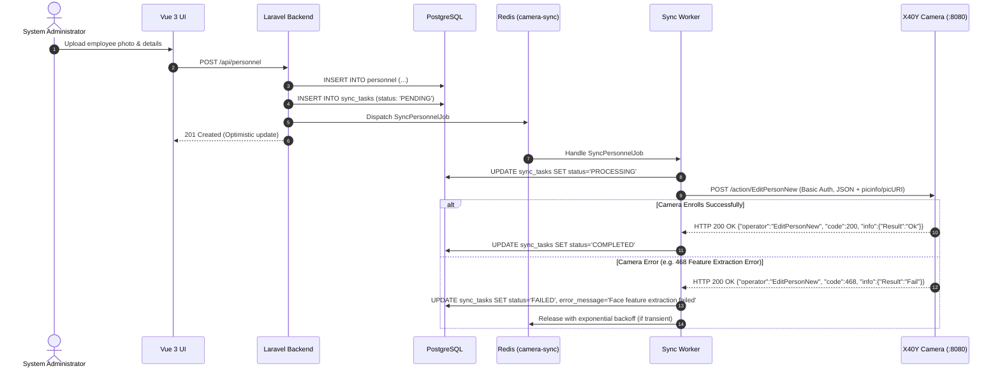
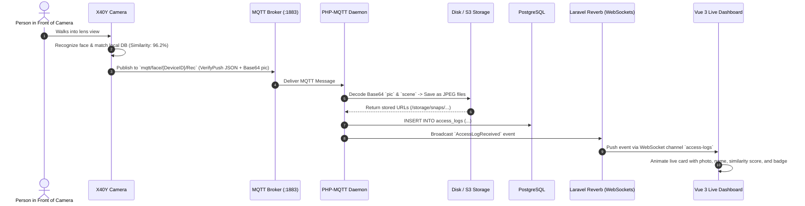

# System Design: Intelligent Vision Edge & Telemetry Hub

> **System Name:** Intelligent Vision Edge & Telemetry Hub  
> **Architecture Pattern:** Decoupled Hybrid Synchronous LAN Provisioning + Asynchronous WAN/MQTT Telemetry Stream  
> **Core Stack:** Laravel 11 (PHP 8.2+), Vue 3 (Vite, Pinia, Tailwind CSS / Shadcn Vue), PostgreSQL 16, Redis, MQTT (EMQX/Mosquitto), Laravel Reverb (WebSockets)

---

## 1. Executive Summary & System Objectives

The **Intelligent Vision Edge & Telemetry Hub** provides a single-pane-of-glass access control, identity synchronizer, and high-throughput vision telemetry processing system for smart IP cameras and biometric edge units (such as X40Y series hardware).

### Key System Objectives
1. **Biometric Face Library Sync**: Maintain master employee records in PostgreSQL and synchronize face photos/schedules to cameras via local HTTP REST dispatchers (`/action/EditPersonNew`, `/action/AddPersons`).
2. **Sub-second Verification Ingestion**: Ingest high-volume face verification logs (`RecPush`), stranger snapshots (`StrSnapPush`), and security alarms in real-time over MQTT.
3. **Live Dashboard Broadcasting**: Push biometric match results, similarity confidence scores, snapshot images, and admission states directly to the Vue 3 dashboard using WebSockets (Laravel Reverb).
4. **Resilient Failure Recovery**: Implement transactional outbox queuing (`sync_tasks`), automatic retry policies with exponential backoff, and MQTT continuous transmission acknowledgements (`PushAck`).

---

## 2. Decoupled Hybrid Architecture

```
                          +-----------------------------------+
                          |      Vue 3 Frontend Client        |
                          |  - Live Biometric Feed            |
                          |  - Personnel Directory & Photos   |
                          |  - Camera Hardware Manager        |
                          +-----------------+-----------------+
                                            ^
                                            | WebSockets (Laravel Reverb)
                                            v
+-----------------------------------------------------------------------------------+
|                           Laravel 11 Backend Platform                             |
|                                                                                   |
|  +--------------------------+  +--------------------------+  +-----------------+  |
|  |     REST API / Web       |  |  Image Storage Service   |  |   PostgreSQL    |  |
|  |   Controllers & Auth     |  |   (S3 / Disk Storage)    |  |   16 Database   |  |
|  +------------+-------------+  +------------+-------------+  +--------+--------+  |
|               |                             ^                         ^           |
|               v                             |                         |           |
|  +--------------------------+               |                         |           |
|  |     Personnel Observer   |               |                         |           |
|  |  (Emits sync_tasks jobs) |               |                         |           |
|  +------------+-------------+               |                         |           |
|               |                             |                         |           |
+---------------|-----------------------------|-------------------------|-----------+
                |                             |                         |
                v (Redis Queue)               |                         |
+-------------------------------+             |                         |
|     LAN Edge Sync Worker      |             |                         |
|  (Queue: camera-sync)         |             |                         |
+---------------+---------------+             |                         |
                |                             |                         |
HTTP POST :8080 | Basic Auth                  |                         |
/action/*       |                             |                         |
                v                             |                         |
+-------------------------------+             |                         |
|     Edge AI Camera (X40Y)     |             |                         |
|     Local IP: 192.168.1.100   |             |                         |
+---------------+---------------+             |                         |
                |                             |                         |
                | MQTT Publish (:1883)        |                         |
                | Topic: mqtt/face/{ID}/*     |                         |
                v                             |                         |
+-------------------------------+             |                         |
|          MQTT Broker          |             |                         |
|       (EMQX / Mosquitto)      |             |                         |
+---------------+---------------+             |                         |
                |                             |                         |
                | MQTT Subscribe (mqtt/face/#)|                         |
                v                             |                         |
+-------------------------------+             |                         |
|   MQTT Telemetry Daemon       |-------------+                         |
|   (php artisan mqtt:listen)   |---------------------------------------+
+-------------------------------+
```

---

## 3. Database Schema Specification (PostgreSQL 16)

```sql
-- Devices table
CREATE TABLE devices (
    id SERIAL PRIMARY KEY,
    device_id VARCHAR(64) UNIQUE NOT NULL,       -- e.g., '1299517' or '005a213b000b93cc'
    name VARCHAR(128) NOT NULL,
    ip_address VARCHAR(45) NOT NULL,             -- e.g., '192.168.1.100'
    port INT DEFAULT 8080,
    username VARCHAR(64) DEFAULT 'admin',
    password VARCHAR(64) DEFAULT 'admin',
    device_type INT DEFAULT 0,                   -- 0: IPC, 1: DVR, 2: NVR, 3: Panel Unit
    mqtt_topic VARCHAR(128),                     -- e.g., 'mqtt/face/1299517'
    is_active BOOLEAN DEFAULT TRUE,
    last_heartbeat_at TIMESTAMP WITH TIME ZONE,
    created_at TIMESTAMP WITH TIME ZONE DEFAULT CURRENT_TIMESTAMP,
    updated_at TIMESTAMP WITH TIME ZONE DEFAULT CURRENT_TIMESTAMP
);

-- Personnel / Face Library
CREATE TABLE personnel (
    id SERIAL PRIMARY KEY,
    customize_id INT UNIQUE NOT NULL,            -- Custom unique ID (IdType=0)
    person_uuid UUID DEFAULT gen_random_uuid(),  -- UUID alternative (IdType=2)
    name VARCHAR(64) NOT NULL,
    person_type INT DEFAULT 0,                   -- 0: Whitelist (Allow), 1: Blacklist (Block)
    gender INT DEFAULT 0,                        -- 0: Male, 1: Female
    id_card VARCHAR(32),
    tel_num VARCHAR(32),
    address VARCHAR(128),
    birthday DATE,
    temp_valid INT DEFAULT 0,                    -- 0: Permanent, 1: Temporary
    valid_begin TIMESTAMP WITH TIME ZONE,
    valid_end TIMESTAMP WITH TIME ZONE,
    effect_number INT DEFAULT 1,                 -- -1: Infinite, 1-10000: Finite passes
    photo_path VARCHAR(255),                     -- Local disk path or cloud storage URL
    photo_base64 TEXT,                           -- Optional cached Base64 representation
    created_at TIMESTAMP WITH TIME ZONE DEFAULT CURRENT_TIMESTAMP,
    updated_at TIMESTAMP WITH TIME ZONE DEFAULT CURRENT_TIMESTAMP
);

-- Access & Verification Telemetry Logs
CREATE TABLE access_logs (
    id BIGSERIAL PRIMARY KEY,
    device_id VARCHAR(64) REFERENCES devices(device_id) ON DELETE CASCADE,
    person_id INT,                               -- Device internal ID
    customize_id INT,
    person_uuid UUID,
    person_name VARCHAR(64),
    verify_status INT NOT NULL,                  -- 1: Allowed, 2: Rejected, 3: Not Registered
    verify_type INT DEFAULT 1,                   -- 1: Whitelist, 2: ID Card, 3: Card+Face
    person_type INT DEFAULT 0,                   -- 0: Whitelist, 1: Blacklist
    similarity NUMERIC(5, 2),                    -- Match similarity score (0.00 to 100.00)
    snap_pic_url VARCHAR(255),                   -- Storage URL for snapshot image
    scene_pic_url VARCHAR(255),                  -- Storage URL for context scene image
    captured_at TIMESTAMP WITH TIME ZONE NOT NULL,
    created_at TIMESTAMP WITH TIME ZONE DEFAULT CURRENT_TIMESTAMP
);

-- Stranger Capture & Detection Alerts
CREATE TABLE stranger_snaps (
    id BIGSERIAL PRIMARY KEY,
    device_id VARCHAR(64) REFERENCES devices(device_id) ON DELETE CASCADE,
    snap_pic_url VARCHAR(255) NOT NULL,
    scene_pic_url VARCHAR(255),
    captured_at TIMESTAMP WITH TIME ZONE NOT NULL,
    created_at TIMESTAMP WITH TIME ZONE DEFAULT CURRENT_TIMESTAMP
);

-- Device Sync Outbox / Job Queue Tracking
CREATE TABLE sync_tasks (
    id BIGSERIAL PRIMARY KEY,
    device_id VARCHAR(64) REFERENCES devices(device_id) ON DELETE CASCADE,
    personnel_id INT REFERENCES personnel(id) ON DELETE CASCADE,
    action VARCHAR(32) NOT NULL,                 -- 'ADD', 'EDIT', 'DELETE'
    status VARCHAR(20) DEFAULT 'PENDING',        -- 'PENDING', 'PROCESSING', 'COMPLETED', 'FAILED'
    attempts INT DEFAULT 0,
    error_message TEXT,
    created_at TIMESTAMP WITH TIME ZONE DEFAULT CURRENT_TIMESTAMP,
    updated_at TIMESTAMP WITH TIME ZONE DEFAULT CURRENT_TIMESTAMP
);
```

---

## 4. Subsystem Components & Workflows

### 4.1 LAN Provisioning & Outbox Synchronization Flow



---

### 4.2 Real-Time Telemetry & WebSocket Ingestion Flow



---

## 5. Protocol Command Reference Mapping

| System Action | Protocol / Method | Target / Topic | Key Parameters |
| :--- | :--- | :--- | :--- |
| **Add / Edit Person** | HTTP POST | `http://<cam_ip>:8080/action/EditPersonNew` | `DeviceID`, `IdType: 0`, `CustomizeID`, `Name`, `PersonType`, `picinfo`/`picURI` |
| **Batch Add (URI)** | HTTP POST | `http://<cam_ip>:8080/action/AddPersons` | `DeviceID`, `Total`, `Personinfo_0: {...}` |
| **Delete Person** | HTTP POST | `http://<cam_ip>:8080/action/DeletePerson` | `DeviceID`, `TotalNum`, `IdType: 0`, `CustomizeID: [id1, id2]` |
| **Wipe Database** | HTTP POST | `http://<cam_ip>:8080/action/DeleteAllPerson` | `DeleteAllPersonCheck: 1` *(Reboots camera)* |
| **Audit Sync / Query** | HTTP POST | `http://<cam_ip>:8080/action/SearchPersonList` | `DeviceID`, `PersonType: 2`, `BeginNO: 0`, `RequestCount: 50` |
| **Push MQTT Config** | HTTP POST | `http://<cam_ip>:8080/action/SetMQTTParam` | `MQEnable: 1`, `MQAddr`, `MQPort`, `MQTopic`, `RecordUploadType: 1` |
| **Reboot Camera** | HTTP POST | `http://<cam_ip>:8080/action/RebootDevice` | `DeviceID`, `IsRebootDevice: 1` |
| **Live Access Telemetry** | MQTT Ingest | `mqtt/face/{DeviceID}/Rec` | `VerifyPush` (`VerifyStatus`, `similarity1`, `pic`, `scene`) |
| **Stranger Detection** | MQTT Ingest | `mqtt/face/{DeviceID}/Snap` | `StrSnapPush` (`CreateTime`, `pic`, `scene`) |
| **Device Heartbeat** | MQTT Ingest | `mqtt/face/heartbeat` | `HeartBeat` (`facesluiceId`, `time`) |

---

## 6. Execution & Deployment Runbook

### Step 1: Database Setup
```bash
# Run database migrations
php artisan migrate --force
```

### Step 2: MQTT Broker Setup
Ensure EMQX or Mosquitto is active on port `1883` with standard authentication.

### Step 3: Link Camera to MQTT Broker
Issue a one-time provisioning HTTP POST request to the camera:
```bash
curl -X POST http://192.168.1.100:8080/action/SetMQTTParam \
  -u admin:admin \
  -H "Content-Type: application/json" \
  -d '{
    "operator": "SetMQTTParam",
    "info": {
      "MQEnable": 1,
      "MQAddr": "192.168.1.50",
      "MQPort": 1883,
      "MQUser": "camera_client",
      "MQPwd": "secure_password",
      "MQTopic": "mqtt/face/1299517",
      "MQCloudID": "1299517",
      "StrangerUploadType": 0,
      "RecordUploadType": 1,
      "KeepAliveInterval": 30,
      "BasicTopic": "mqtt/face/basic",
      "HeartbeatTopic": "mqtt/face/heartbeat",
      "ResumefromBreakpoint": 1
    }
  }'
```

### Step 4: Supervisord Daemons
Configure Supervisor configuration file `/etc/supervisor/conf.d/ai-camera-hub.conf`:
```ini
[program:camera-sync-worker]
process_name=%(program_name)s_%(process_num)02d
command=php /var/www/artisan queue:work redis --queue=camera-sync --sleep=3 --tries=3 --max-time=3600
autostart=true
autorestart=true
numprocs=2
redirect_stderr=true
stdout_logfile=/var/log/camera-sync.log

[program:mqtt-telemetry-daemon]
process_name=%(program_name)s
command=php /var/www/artisan mqtt:listen
autostart=true
autorestart=true
numprocs=1
redirect_stderr=true
stdout_logfile=/var/log/mqtt-telemetry.log

[program:reverb-websocket]
process_name=%(program_name)s
command=php /var/www/artisan reverb:start
autostart=true
autorestart=true
numprocs=1
redirect_stderr=true
stdout_logfile=/var/log/reverb.log
```

### Step 5: Frontend Dashboard
```bash
cd frontend && npm install && npm run dev
```
