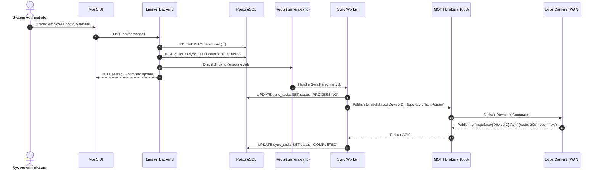
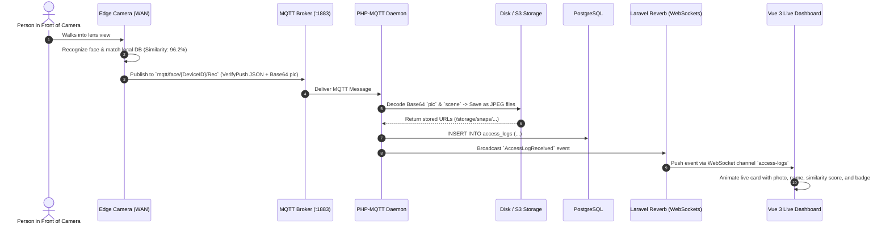

# System Design: Intelligent AI Camera Hub

> **System Name:** Intelligent AI Camera Hub  
> **Architecture Pattern:** Pure WAN MQTT Telemetry Ingestion & Downlink Command Dispatch  
> **Core Stack:** Laravel 11 (PHP 8.2+), Vue 3 (Vite, Pinia, Tailwind CSS), PostgreSQL 16, Redis, MQTT (EMQX/Mosquitto), Laravel Reverb (WebSockets)

---

## 1. Executive Summary & System Objectives

The **Intelligent AI Camera Hub** provides a single-pane-of-glass access control, identity synchronizer, and high-throughput vision telemetry processing system for smart IP cameras and biometric edge units (such as X40Y series hardware) operating over WAN networks.

### Key System Objectives

1. **Biometric Face Library Sync (MQTT Downlink)**: Maintain master employee records in PostgreSQL and synchronize face photos/schedules to cameras via MQTT downlink command topics (`mqtt/face/<DeviceID>`) using operators `EditPerson`, `AddPersons`, and `DelPerson`.
2. **Sub-second Verification Ingestion (MQTT Uplink)**: Ingest high-volume face verification logs (`RecPush`), stranger snapshots (`StrSnapPush`), and security alarms in real-time over MQTT.
3. **Live Dashboard Broadcasting**: Push biometric match results, similarity confidence scores, snapshot images, and admission states directly to the Vue 3 dashboard using WebSockets (Laravel Reverb).
4. **Resilient Failure Recovery**: Implement transactional outbox queuing (`sync_tasks`), automatic retry policies with exponential backoff, and MQTT continuous transmission acknowledgements (`PushAck`).
5. **Manual Device Bootstrap**: Initial MQTT broker parameters (broker host, port 1883, topics) are manually entered directly on the camera's local web configuration interface.

---

## 2. Pure WAN MQTT Architecture

```
                          +-----------------------------------+
                          |      Vue 3 Frontend Client        |
                          |  - Live Biometric Feed            |
                          |  - Personnel Directory & Photos   |
                          |  - Camera Hardware Manager        |
                          +-----------------+-----------------+
                                            ^
                                            | WebSockets (Laravel Reverb)
                                            v
+-----------------------------------------------------------------------------------+
|                           Laravel 11 Backend Platform                             |
|                                                                                   |
|  +--------------------------+  +--------------------------+  +-----------------+  |
|  |     REST API / Web       |  |  Image Storage Service   |  |   PostgreSQL    |  |
|  |   Controllers & Auth     |  |   (S3 / Disk Storage)    |  |   16 Database   |  |
|  +------------+-------------+  +------------+-------------+  +--------+--------+  |
|               |                             ^                         ^           |
|               v                             |                         |           |
|  +--------------------------+               |                         |           |
|  |     Personnel Observer   |               |                         |           |
|  |  (Emits sync_tasks jobs) |               |                         |           |
|  +------------+-------------+               |                         |           |
|               |                             |                         |           |
+---------------|-----------------------------|-------------------------|-----------+
                |                             |                         |
                v (Redis Queue)               |                         |
+-------------------------------+             |                         |
|     WAN MQTT Sync Worker      |             |                         |
|  (Queue: camera-sync)         |             |                         |
+---------------+---------------+             |                         |
                |                             |                         |
                | MQTT Downlink Publish       |                         |
                | Topic: mqtt/face/{ID}       |                         |
                v                             |                         |
+-------------------------------+             |                         |
|          MQTT Broker          |             |                         |
|       (EMQX / Mosquitto)      |             |                         |
+---------------+---------------+             |                         |
                ^                             |                         |
                | MQTT Uplink / Downlink      |                         |
                v                             |                         |
+-------------------------------+             |                         |
|     Edge AI Camera (X40Y)     |             |                         |
|     Connected via WAN         |             |                         |
+---------------+---------------+             |                         |
                |                             |                         |
                | MQTT Subscribe (mqtt/face/#)|                         |
                v                             |                         |
+-------------------------------+             |                         |
|   MQTT Telemetry Daemon       |-------------+                         |
|   (php artisan mqtt:listen)   |---------------------------------------+
+-------------------------------+
```

---

## 3. Database Schema Specification (PostgreSQL 16)

```sql
-- Devices table
CREATE TABLE devices (
    id SERIAL PRIMARY KEY,
    device_id VARCHAR(64) UNIQUE NOT NULL,       -- e.g., '1299517' or '005a213b000b93cc'
    name VARCHAR(128) NOT NULL,
    ip_address VARCHAR(45) NOT NULL,             -- e.g., '192.168.1.100' or WAN hostname
    port INT DEFAULT 1883,
    username VARCHAR(64) DEFAULT 'admin',
    password VARCHAR(64) DEFAULT 'admin',
    device_type INT DEFAULT 0,                   -- 0: IPC, 1: DVR, 2: NVR, 3: Panel Unit
    mqtt_topic VARCHAR(128),                     -- e.g., 'mqtt/face/1299517'
    is_active BOOLEAN DEFAULT TRUE,
    last_heartbeat_at TIMESTAMP WITH TIME ZONE,
    created_at TIMESTAMP WITH TIME ZONE DEFAULT CURRENT_TIMESTAMP,
    updated_at TIMESTAMP WITH TIME ZONE DEFAULT CURRENT_TIMESTAMP
);

-- Personnel / Face Library
CREATE TABLE personnel (
    id SERIAL PRIMARY KEY,
    customize_id INT UNIQUE NOT NULL,
    person_uuid UUID DEFAULT gen_random_uuid(),
    name VARCHAR(64) NOT NULL,
    person_type INT DEFAULT 0,                   -- 0: Whitelist, 1: Blacklist
    gender INT DEFAULT 0,                        -- 0: Male, 1: Female
    id_card VARCHAR(32),
    tel_num VARCHAR(32),
    address VARCHAR(128),
    birthday DATE,
    temp_valid INT DEFAULT 0,
    valid_begin TIMESTAMP WITH TIME ZONE,
    valid_end TIMESTAMP WITH TIME ZONE,
    effect_number INT DEFAULT 1,
    photo_path VARCHAR(255),
    photo_base64 TEXT,
    created_at TIMESTAMP WITH TIME ZONE DEFAULT CURRENT_TIMESTAMP,
    updated_at TIMESTAMP WITH TIME ZONE DEFAULT CURRENT_TIMESTAMP
);

-- Access & Verification Telemetry Logs
CREATE TABLE access_logs (
    id BIGSERIAL PRIMARY KEY,
    device_id VARCHAR(64) REFERENCES devices(device_id) ON DELETE CASCADE,
    person_id INT,
    customize_id INT,
    person_uuid UUID,
    person_name VARCHAR(64),
    verify_status INT NOT NULL,                  -- 1: Allowed, 2: Rejected, 3: Not Registered
    verify_type INT DEFAULT 1,
    person_type INT DEFAULT 0,
    similarity NUMERIC(5, 2),
    snap_pic_url VARCHAR(255),
    scene_pic_url VARCHAR(255),
    captured_at TIMESTAMP WITH TIME ZONE NOT NULL,
    created_at TIMESTAMP WITH TIME ZONE DEFAULT CURRENT_TIMESTAMP
);

-- Stranger Capture & Detection Alerts
CREATE TABLE stranger_snaps (
    id BIGSERIAL PRIMARY KEY,
    device_id VARCHAR(64) REFERENCES devices(device_id) ON DELETE CASCADE,
    snap_pic_url VARCHAR(255) NOT NULL,
    scene_pic_url VARCHAR(255),
    captured_at TIMESTAMP WITH TIME ZONE NOT NULL,
    created_at TIMESTAMP WITH TIME ZONE DEFAULT CURRENT_TIMESTAMP
);

-- Device Sync Outbox / Job Queue Tracking
CREATE TABLE sync_tasks (
    id BIGSERIAL PRIMARY KEY,
    device_id VARCHAR(64) REFERENCES devices(device_id) ON DELETE CASCADE,
    personnel_id INT REFERENCES personnel(id) ON DELETE CASCADE,
    action VARCHAR(32) NOT NULL,                 -- 'ADD', 'EDIT', 'DELETE'
    status VARCHAR(20) DEFAULT 'PENDING',        -- 'PENDING', 'PROCESSING', 'COMPLETED', 'FAILED'
    attempts INT DEFAULT 0,
    error_message TEXT,
    created_at TIMESTAMP WITH TIME ZONE DEFAULT CURRENT_TIMESTAMP,
    updated_at TIMESTAMP WITH TIME ZONE DEFAULT CURRENT_TIMESTAMP
);
```

---

## 4. Subsystem Components & Workflows

### 4.1 WAN MQTT Provisioning & Outbox Synchronization Flow


```mermaid
sequenceDiagram
    autonumber
    actor Admin as System Administrator
    participant UI as Vue 3 UI
    participant Backend as Laravel Backend
    participant DB as PostgreSQL
    participant Queue as Redis (camera-sync)
    participant Worker as Sync Worker
    participant Broker as MQTT Broker (:1883)
    participant Camera as Edge Camera (WAN)

    Admin->>UI: Upload employee photo & details
    UI->>Backend: POST /api/personnel
    Backend->>DB: INSERT INTO personnel (...)
    Backend->>DB: INSERT INTO sync_tasks (status: 'PENDING')
    Backend->>Queue: Dispatch SyncPersonnelJob
    Backend-->>UI: 201 Created (Optimistic update)

    Queue->>Worker: Handle SyncPersonnelJob
    Worker->>DB: UPDATE sync_tasks SET status='PROCESSING'
    Worker->>Broker: Publish to `mqtt/face/{DeviceID}` (operator: "EditPerson")
    Broker->>Camera: Deliver Downlink Command

    Camera-->>Broker: Publish to `mqtt/face/{DeviceID}/Ack` (code: 200, result: "ok")
    Broker-->>Worker: Deliver ACK
    Worker->>DB: UPDATE sync_tasks SET status='COMPLETED'
```

---

### 4.2 Real-Time Telemetry & WebSocket Ingestion Flow


```mermaid
sequenceDiagram
    autonumber
    actor User as Person in Front of Camera
    participant Camera as Edge Camera (WAN)
    participant Broker as MQTT Broker (:1883)
    participant Daemon as PHP-MQTT Daemon
    participant Storage as Disk / S3 Storage
    participant DB as PostgreSQL
    participant Reverb as Laravel Reverb (WebSockets)
    participant UI as Vue 3 Live Dashboard

    User->>Camera: Walks into lens view
    Camera->>Camera: Recognize face & match local DB (Similarity: 96.2%)
    Camera->>Broker: Publish to `mqtt/face/{DeviceID}/Rec` (VerifyPush JSON + Base64 pic)
    Broker->>Daemon: Deliver MQTT Message

    Daemon->>Storage: Decode Base64 `pic` & `scene` -> Save as JPEG files
    Storage-->>Daemon: Return stored URLs (/storage/snaps/...)
    Daemon->>DB: INSERT INTO access_logs (...)
    Daemon->>Reverb: Broadcast `AccessLogReceived` event
    Reverb->>UI: Push event via WebSocket channel `access-logs`
    UI->>UI: Animate live card with photo, name, similarity score, and badge
```

---

## 5. Protocol Command Reference Mapping (Pure MQTT WAN)

| System Action             | Protocol / Method | Target Topic               | Key Parameters                                                                   |
| :------------------------ | :---------------- | :------------------------- | :------------------------------------------------------------------------------- |
| **Add / Edit Person**     | MQTT Downlink     | `mqtt/face/{DeviceID}`     | `operator: "EditPerson"`, `facesluiceId`, `customId`, `name`, `pic` / `picURI`   |
| **Batch Add Personnel**   | MQTT Downlink     | `mqtt/face/{DeviceID}`     | `operator: "AddPersons"`, `PersonNum`, `Personinfo_0: {...}`                     |
| **Delete Person**         | MQTT Downlink     | `mqtt/face/{DeviceID}`     | `operator: "DelPerson"` / `"DeletePersons"`, `customId: [...]`                   |
| **Wipe Database**         | MQTT Downlink     | `mqtt/face/{DeviceID}`     | `operator: "DeleteAllPerson"`, `deleteall: 1`                                    |
| **Search List**           | MQTT Downlink     | `mqtt/face/{DeviceID}`     | `operator: "SearchPersonList"`, `PersonType: 2`, `BeginNO: 0`, `RequestCount: 50`|
| **Update MQTT Settings**  | MQTT Downlink     | `mqtt/face/{DeviceID}`     | `operator: "UpMQTTconfig"`, `StrangerUploadType`, `RecordUploadType`, `KeepAlive`|
| **Reboot Camera**         | MQTT Downlink     | `mqtt/face/{DeviceID}`     | `operator: "RebootDevice"`, `facesluiceId`                                       |
| **Time Synchronization**  | MQTT Downlink     | `mqtt/face/{DeviceID}`     | `operator: "SetSysTime"`, `time: "YYYY-MM-DD hh:mm:ss"`                          |
| **Device Information**    | MQTT Downlink     | `mqtt/face/{DeviceID}`     | `operator: "GetDeviceInformation"`, `facesluiceId`                               |
| **Live Access Telemetry** | MQTT Uplink       | `mqtt/face/{DeviceID}/Rec` | `VerifyPush` (`VerifyStatus`, `similarity1`, `pic`, `scene`)                     |
| **Stranger Detection**    | MQTT Uplink       | `mqtt/face/{DeviceID}/Snap`| `StrSnapPush` (`CreateTime`, `pic`, `scene`)                                     |
| **Device Heartbeat**      | MQTT Uplink       | `mqtt/face/heartbeat`      | `HeartBeat` (`facesluiceId`, `time`)                                             |
| **Online / LWT Status**   | MQTT Uplink/LWT   | `mqtt/face/basic`          | `Online` / `Offline` (`facesluiceId`, `ip`, `time`)                              |

---

## 6. Production Execution & Supervisord Config

```ini
[program:camera-hub-mqtt]
process_name=%(program_name)s
command=php /var/www/camera_hub/artisan mqtt:listen
autostart=true
autorestart=true
user=www-data
numprocs=1
redirect_stderr=true
stdout_logfile=/var/log/supervisor/camera-hub-mqtt.log

[program:camera-hub-sync-worker]
process_name=%(program_name)s_%(process_num)02d
command=php /var/www/camera_hub/artisan queue:work redis --queue=camera-sync --sleep=3 --tries=3
autostart=true
autorestart=true
user=www-data
numprocs=2
redirect_stderr=true
stdout_logfile=/var/log/supervisor/camera-hub-sync.log

[program:camera-hub-reverb]
process_name=%(program_name)s
command=php /var/www/camera_hub/artisan reverb:start --host=0.0.0.0 --port=8080
autostart=true
autorestart=true
user=www-data
numprocs=1
redirect_stderr=true
stdout_logfile=/var/log/supervisor/camera-hub-reverb.log
```
