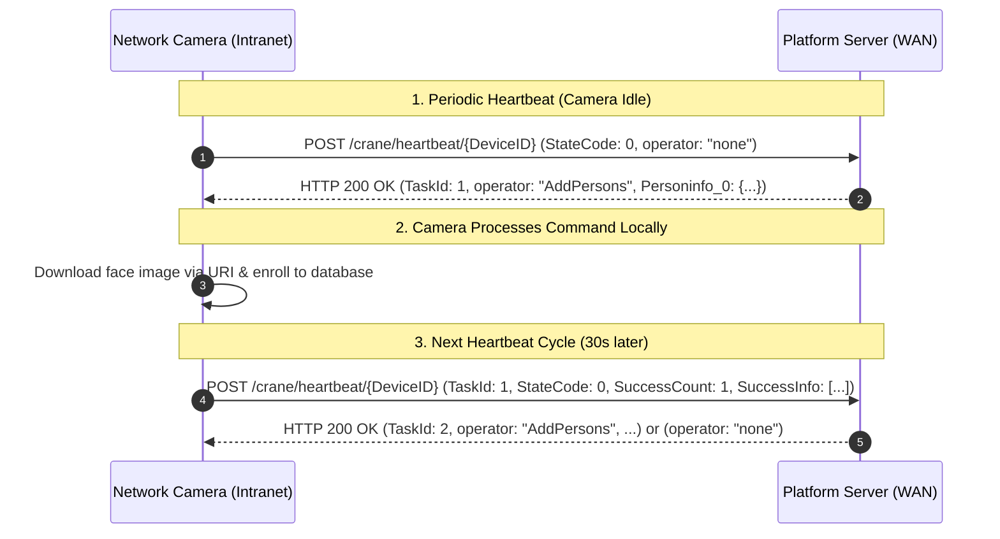

# X40Y Wide Area Network (WAN) HTTP Interface Protocol (V1.01) - Technical Specification & Integration Context

> **Target Hardware:** X40Y Series Intelligent Face Recognition & Network AI Cameras  
> **Protocol Document:** X40Y Wide Area Network HTTP Interface Protocol V1.01  
> **Architecture Pattern:** Reverse-Polling / Command-in-Heartbeat over HTTP  

---

## Table of Contents

1. [Architecture & Design Motivation](#1-architecture--design-motivation)
   - [The NAT / Intranet Challenge](#11-the-nat--intranet-challenge)
   - [Reverse-Polling Principle](#12-reverse-polling-principle)
   - [Interaction Lifecycle Sequence](#13-interaction-lifecycle-sequence)
2. [Interface Principles & Communication Rules](#2-interface-principles--communication-rules)
   - [HTTP Methods & Encodings](#21-http-methods--encodings)
   - [URI Structure & Addressing](#22-uri-structure--addressing)
3. [Heartbeat & Command Exchange Mechanism](#3-heartbeat--command-exchange-mechanism)
   - [Device Heartbeat Request Payload (`POST /crane/heartbeat/{DeviceID}`)](#31-device-heartbeat-request-payload)
   - [Platform Command Dispatch Response (HTTP 200 OK)](#32-platform-command-dispatch-response)
   - [Execution Status & Error Reporting](#33-execution-status--error-reporting)
4. [WAN Supported Instruction Set & Constraints](#4-wan-supported-instruction-set--constraints)
   - [Supported Operations](#41-supported-operations)
   - [WAN vs. LAN Protocol Differences](#42-wan-vs-lan-protocol-differences)
5. [End-to-End Interaction Flow Walkthrough](#5-end-to-end-interaction-flow-walkthrough)
   - [Step 1: Initial Idle Heartbeat](#step-1-initial-idle-heartbeat)
   - [Step 2: Server Injects Task into Heartbeat Response](#step-2-server-injects-task-into-heartbeat-response)
   - [Step 3: Device Executes Task & Reports Progress / Result](#step-3-device-executes-task--reports-progress--result)
   - [Step 4: Server Acknowledges & Dispatches Next Task](#step-4-server-acknowledges--dispatches-next-task)

---

## 1. Architecture & Design Motivation

### 1.1 The NAT / Intranet Challenge
In traditional LAN deployments, the management platform directly sends HTTP POST requests to the camera's local IP address (e.g. `http://192.168.1.10:8080/action/AddPersons`).

However, when cameras are deployed in **Intranets, branch offices, or behind 4G/cellular routers**, they do not possess public IPv4 addresses and cannot be reached directly from the cloud platform without complex VPNs or port forwarding.

```
+--------------------------+                      +--------------------------+
|      Camera in LAN       |                      |       Cloud Server       |
|    (Behind NAT / 4G)     |                      |       (Public WAN)       |
+--------------------------+                      +--------------------------+
             |                                                  |
             |   X Direct HTTP POST from Server is blocked      |
             |   < - - - - - - - - - - - - - - - - - - - - - -  |
             |                                                  |
             |   ==> Solution: Camera initiates outbound HTTP   |
             |       POST Heartbeat every 30 seconds            |
             |   -------------------------------------------->  |
             |   <--------------------------------------------  |
             |       Server piggybacks pending command in 200 OK|
```

### 1.2 Reverse-Polling Principle
To overcome NAT and firewall barriers, the X40Y WAN protocol uses **HTTP Reverse-Polling via Heartbeat**:
1. The camera initiates an outbound HTTP POST request to the cloud server's heartbeat endpoint every **30 seconds**.
2. If the cloud server has pending instructions (e.g. enroll person, delete person, search), the server embeds the command inside the **HTTP 200 OK response** body.
3. The camera receives the command, executes it asynchronously in its local database/hardware, and reports the execution status, progress, and error details in the **subsequent heartbeat POST**.
4. If the cloud server has no pending commands, it returns `"operator": "none"`.

---

### 1.3 Interaction Lifecycle Sequence



---

## 2. Interface Principles & Communication Rules

### 2.1 HTTP Methods & Encodings
- **Method**: HTTP POST
- **Encoding**: UTF-8
- **Payload Format**: `application/json`
- **Headers**: Must include `Content-Length` or `Transfer-Encoding: chunked`, `User-Agent: FaceGate-HttpClient/0.0.1`, `Connection: Keep-Alive`.

### 2.2 URI Structure & Addressing
Heartbeat endpoint format on the cloud server:
```http
POST /crane/heartbeat/<DeviceID> HTTP/1.1
Host: <cloud_server_ip_or_domain>
Content-Type: application/json; charset=UTF-8
```

---

## 3. Heartbeat & Command Exchange Mechanism

### 3.1 Device Heartbeat Request Payload

Sent by the camera to `POST /crane/heartbeat/<DeviceID>`:

```json
{
  "operator": "HeartBeat",
  "info": {
    "DeviceID": 1413724,
    "Time": "2024-08-22T20:46:56"
  },
  "data": {
    "TaskId": 1,
    "StateCode": 0,
    "OperatorInfo": {
      "operator": "AddPersons",
      "SuccessCount": 1,
      "ProgressText": "1/1",
      "ErrCount": 0,
      "errorInfo": [],
      "SuccessInfo": [
        {
          "Personinfo": 0,
          "CustomizeID": 120,
          "PersonUUID": "4476c20c-23ce-4178-8672-b292d33a3c20"
        }
      ]
    }
  }
}
```

#### Heartbeat `data` Schema:
| Field Name | Type | Description |
| :--- | :--- | :--- |
| `TaskId` | int | ID of the current or recently completed task (`0` if no prior task) |
| `StateCode` | int | `0`: Device is idle or task completed, `1`: Device is actively executing task |
| `OperatorInfo.operator` | string | Command name executed (`"none"` if idle, `"AddPersons"`, `"DeletePerson"`, etc.) |
| `OperatorInfo.SuccessCount` | int | Number of successfully processed items |
| `OperatorInfo.ProgressText` | string | Task completion ratio string (e.g. `"100/1000"`) |
| `OperatorInfo.ErrCount` | int | Total number of failed items |
| `OperatorInfo.errorInfo` | array | Array of error objects: `[{"errcode": "468", "errorItem": "<UUID>", "errordesc": "Face not valid"}]` |
| `OperatorInfo.SuccessInfo` | array | Array of success items: `[{"CustomizeID": 120, "PersonUUID": "<UUID>"}]` |

---

### 3.2 Platform Command Dispatch Response

When the server receives a heartbeat, it responds with HTTP 200 OK. If a task is ready for dispatch, the command payload is returned:

```json
{
  "TimeStamp": 1607949634,
  "TaskId": 1,
  "OperatorInfo": {
    "Total": 1,
    "DeviceID": "1413724",
    "operator": "AddPersons",
    "Personinfo_0": {
      "PersonType": 0,
      "Name": "John Doe",
      "Gender": 0,
      "Nation": 0,
      "CardType": 0,
      "IdCard": "430923199011044411",
      "Birthday": "1990-11-04",
      "Telnum": "18888888888",
      "Native": "Guangdong",
      "Address": "Shenzhen Bao'an",
      "Notes": "Contractor",
      "MjCardFrom": 2,
      "WiegandType": 7,
      "CardMode": 1,
      "WGFacilityCode": "9A",
      "MjCardNo": "0192B3",
      "RFIDCard": "9A0192B3",
      "Tempvalid": 0,
      "CustomizeID": 120,
      "PersonUUID": "4476c20c-23ce-4178-8672-b292d33a3c20",
      "isCheckSimilarity": 0,
      "ValidBegin": "2024-01-01T00:00:00",
      "ValidEnd": "2025-12-31T23:59:59",
      "picURI": "https://cdn.example.com/faces/johndoe.jpg"
    }
  }
}
```

If no task is pending, the server responds with:
```json
{
  "TimeStamp": 1607949634,
  "TaskId": 0,
  "OperatorInfo": {
    "operator": "none"
  }
}
```

---

## 4. WAN Supported Instruction Set & Constraints

### 4.1 Supported Operations

| LAN Operator | WAN Support | Capacity Limit | Notes |
| :--- | :--- | :--- | :--- |
| `AddPersons` | Yes | Max **500** via URI | Cannot run concurrently with `EditPersonsNew` or `DeletePerson` |
| `EditPersonsNew` | Yes | Max **500** via URI | Cannot run concurrently with `AddPersons` or `DeletePerson` |
| `DeletePerson` | Yes | Single / Multiple | Cannot run concurrently with add operations |
| `DeleteAllPerson` | Yes | Full DB Wipe | Deletes all faces; triggers camera reboot |
| `Subscribe` | Yes | Configures Push URLs | Used to point event pushes (`Snap`, `Verify`) to WAN servers |
| `SnapPush` | Yes | Push event | Pushes stranger / violation events |
| `VerifyPush` | Yes | Push event | Pushes face authentication verification events |
| `GetSubscribe` | Yes | Query | Queries active subscriptions |
| `Unsubscribe` | Yes | Cancel | Cancels event subscriptions |
| `SearchPerson` | Yes | Single query | Queries face information by ID |
| `SearchPersonList` | Yes | Multi-person query | Paged query by time or name |

### 4.2 WAN vs. LAN Protocol Differences

1. **Transport Direction**:
   - LAN: Server &rarr; Camera (Direct HTTP request).
   - WAN: Camera &rarr; Server (Outbound heartbeat, server returns command in response).
2. **Batch Size Limit**:
   - LAN: Up to 1000 persons via URI.
   - WAN: Up to **500 persons** via URI per task.
3. **Concurrency Rule**:
   - On WAN, **only one command can execute at a time**. The platform must inspect the heartbeat `StateCode: 0` before assigning a new `TaskId`.

---

## 5. End-to-End Interaction Flow Walkthrough

### Step 1: Initial Idle Heartbeat
**Camera Request:**
```http
POST /crane/heartbeat/1413724 HTTP/1.1
Host: 192.168.0.22
User-Agent: FaceGate-HttpClient/0.0.1
Content-Type: application/json; charset=UTF-8

{
  "operator": "HeartBeat",
  "info": {
    "DeviceID": 1413724,
    "Time": "2024-08-22T20:46:56"
  },
  "data": {
    "TaskId": 0,
    "StateCode": 0,
    "OperatorInfo": {
      "operator": "none",
      "SuccessCount": 0,
      "ProgressText": "",
      "ErrCount": 0,
      "errorInfo": [
        {
          "errcode": "0",
          "errorItem": "111",
          "errordesc": "Idle"
        }
      ],
      "SuccessInfo": []
    }
  }
}
```

### Step 2: Server Injects Task into Heartbeat Response
**Server HTTP 200 OK Response:**
```json
{
  "TimeStamp": 1607949634,
  "TaskId": 101,
  "OperatorInfo": {
    "Total": 1,
    "DeviceID": "1413724",
    "operator": "AddPersons",
    "Personinfo_0": {
      "PersonType": 0,
      "Name": "Alice Wang",
      "CustomizeID": 121,
      "PersonUUID": "4476c20c-23ce-4178-8672-b292d33a3c21",
      "picURI": "https://cdn.example.com/face/alice.jpg"
    }
  }
}
```

### Step 3: Device Executes Task & Reports Progress / Result
30 seconds later, the camera sends its next heartbeat containing the execution result:

**Camera Request:**
```json
{
  "operator": "HeartBeat",
  "info": {
    "DeviceID": 1413724,
    "Time": "2024-08-22T20:47:26"
  },
  "data": {
    "TaskId": 101,
    "StateCode": 0,
    "OperatorInfo": {
      "operator": "AddPersons",
      "SuccessCount": 1,
      "ProgressText": "1/1",
      "ErrCount": 0,
      "errorInfo": [],
      "SuccessInfo": [
        {
          "Personinfo": 0,
          "CustomizeID": 121,
          "PersonUUID": "4476c20c-23ce-4178-8672-b292d33a3c21"
        }
      ]
    }
  }
}
```

### Step 4: Server Acknowledges & Dispatches Next Task
Because `StateCode == 0` and `TaskId == 101` succeeded, the server marks Task 101 as completed and either returns the next task (`TaskId: 102`) or returns `"operator": "none"`.
