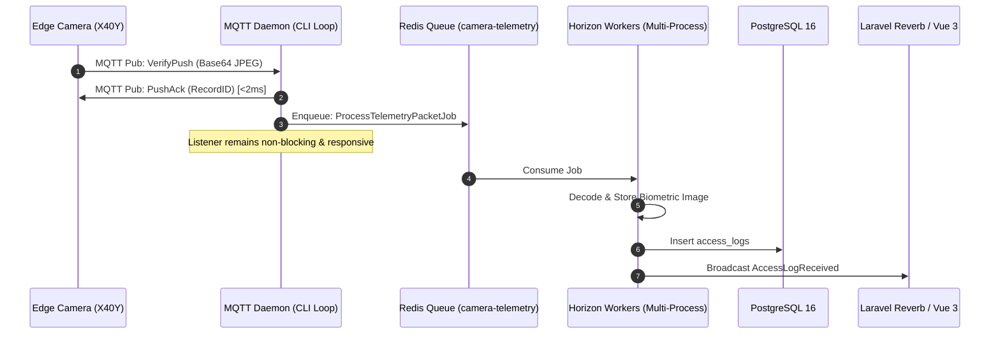
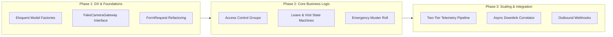

# Architecture & Feature Recommendation Report
**Domain / Module Evaluated:** `Core Biometric Platform & Edge Vision Hub (app/, routes/api.php, resources/js/)`

---

## Executive Architectural Assessment

The **Intelligent AI Camera Hub** has established a solid architectural foundation:
- **Pure WAN MQTT Infrastructure**: Clean separation of uplink telemetry streams (`mqtt/face/{DeviceID}/Rec`, `Snap`, `heartbeat`) and downlink commands (`mqtt/face/{DeviceID}`).
- **Real-Time Edge Synchronization**: Asynchronous event dispatching (`AccessLogReceived`, `AttendancePunchReceived`) bridging vision telemetry into attendance records and Laravel Reverb WebSockets.
- **Enterprise Domain Breadth**: Role-based access control (RBAC), multi-location organizations, shifts with overnight support, visitor credentials, and audit trails.

However, as the system transitions from a single-facility pilot to a multi-site enterprise platform, three critical technical horizons require strategic evolution:
1. **Business Logic Completeness**: Introducing zone-based device access controls, closing gaps in entity lifecycle states (leave cancellation, visitor no-shows), and enabling outbound webhook integrations.
2. **Developer Experience (DX) & Testability**: Eliminating production environment checks (`app()->environment('testing')`), introducing Eloquent Model Factories, and extracting monolithic controller logic into Form Requests and Domain Actions.
3. **High-Throughput Scaling**: Decoupling synchronous Base64 image decoding from the single-threaded MQTT listener and replacing synchronous blocking downlink polling with an asynchronous Command Correlator pattern.

---

## High-Leverage Feature Proposals

| Feature Proposal | Business Impact | Engineering Effort | Priority Matrix |
| :--- | :--- | :--- | :--- |
| **1. Access Control Groups & Zone-Based Dispatching** | High | Low–Medium | **High Impact / Low Effort** |
| **2. Resilient Domain Lifecycle State Machines (Leaves & Visits)** | High | Low | **High Impact / Low Effort** |
| **3. Outbound Webhook Subscriptions & SIEM/HRMS Integration** | High | Medium | **High Impact / Medium Effort** |
| **4. Real-Time Emergency Muster Roster & Facility Lockdown** | High | Low | **High Impact / Low Effort** |
| **5. Bulk Workforce Operations & Fleet Provisioning Campaigns** | Medium | Low | **Medium Impact / Low Effort** |

---

### Feature 1: Granular Access Control Groups & Zone-Based Biometric Dispatching
**Impact vs. Effort:** High Impact / Low Effort

- **Value Proposition:**
  Currently, any personnel creation, photo update, or deletion automatically broadcasts to **every active camera** across the entire database via `SyncPersonnelJob` (`Device::where('is_active', true)->get()`). In enterprise environments with multiple branches, buildings, or restricted zones (e.g., server rooms, executive suites), syncing all personnel to all edge cameras:
  1. Overflows edge hardware onboard face capacity (typically 10,000–50,000 face templates).
  2. Violates physical access segmentation (a warehouse worker should not have biometric access to the data center).
  3. Causes network and broker congestion by dispatching redundant MQTT commands.

- **Domain Fit:**
  The schema already defines `devices.location_id`, `devices.department_ids`, and `devices.device_role`. Introducing an explicit **Access Group** domain cleanly links `personnel` (and employees/visitors) to specific target devices or zones without altering core MQTT communication primitives.

- **System Blueprint:**
  - **Data Layer:**
    - Migration `create_access_groups_table`: `id`, `organization_id`, `name`, `code`, `description`, `is_active`, `timestamps`.
    - Pivot `access_group_device`: `access_group_id`, `device_id`.
    - Pivot `access_group_personnel`: `access_group_id`, `personnel_id`, `schedule_rule_id` (optional shift/time rule).
    - Pivot `access_group_department`: `access_group_id`, `department_id` (auto-grants access based on department membership).
  - **Logic / Services:**
    - `App\Services\AccessControlService`: Resolves authorized devices for any given personnel or employee:
      ```php
      public function getAuthorizedDevicesForPersonnel(Personnel $personnel): Collection
      ```
    - Update `App\Jobs\SyncPersonnelJob`: Refactor target resolution from `Device::where('is_active', true)` to `AccessControlService::getAuthorizedDevicesForPersonnel($personnel)`.
    - Event `AccessGroupMembersChanged`: Dispatches diff sync jobs (adds to newly assigned cameras, removes from unassigned cameras).
  - **API / UI Surfaces:**
    - Routes:
      - `GET|POST /api/access-groups`
      - `GET|PUT|DELETE /api/access-groups/{accessGroup}`
      - `POST /api/access-groups/{accessGroup}/sync-now`
    - UI: `AccessGroupManager.vue` in settings/security console allowing matrix assignment of departments/employees to device zones.
- **Implementation Complexity:** `M`

---

### Feature 2: Resilient Domain Lifecycle State Machines (Leaves, Regularizations & Visits)
**Impact vs. Effort:** High Impact / Low Effort

- **Value Proposition:**
  Closes critical lifecycle dead-ends across self-service and visitor workflows:
  1. **Leave Cancellation Flow**: Currently, an approved leave cannot be cancelled. When plans change, employees or HR cannot revoke an approved request, leaving the employee's leave balance deducted and daily attendance marked as `'on_leave'`.
  2. **Regularization Escalation & Withdrawal**: Employees cannot cancel misfiled regularization requests before manager review.
  3. **Visitor No-Show & Overstay States**: Pre-registered visits (`Visit`) currently only support `expected -> checked_in -> checked_out`. Abandoned visits remain in `status = 'expected'` forever, while visitors who never check out remain active in `checked_in` without automated security flags.

- **Domain Fit:**
  Extends existing `LeaveService`, `RegularizationController`, and `VisitorSyncService` without introducing new architectural layers.

- **System Blueprint:**
  - **Data Layer:**
    - Migration: Expand enum/string checks for `leave_requests.status` (`cancelled`), `visits.status` (`cancelled`, `no_show`, `overstayed`), and add `cancellation_reason`, `cancelled_by`, `cancelled_at` columns.
    - Add `expected_departure` constraint and `overstay_alerted_at` timestamp on `visits`.
  - **Logic / Services:**
    - `LeaveService::cancelLeaveRequest(LeaveRequest $request, User $user, string $reason)`:
      - Validates state transition (`pending -> cancelled` or `approved -> cancelled`).
      - Atomically reverses `LeaveBalance`: restores `used` or `pending` days via database transaction.
      - Reverts corresponding `AttendanceRecord` statuses and triggers recalculation via `AttendanceProcessingService::processDay()`.
    - `VisitorSyncService::cancelVisit(Visit $visit)`: Marks visit `cancelled`.
    - Scheduled Job `DetectOverstayVisitorsJob` (runs every 15 minutes): Flags visits where `now() > expected_departure` without checkout, firing `DeviceAlert` and security notifications.
    - Scheduled Job `ExpireNoShowVisitsJob` (runs at midnight): Transitions remaining `expected` visits from previous days to `no_show`.
  - **API / UI Surfaces:**
    - Routes:
      - `POST /api/leave-requests/{id}/cancel`
      - `POST /api/regularization-requests/{id}/cancel`
      - `POST /api/visits/{id}/cancel`
      - `GET /api/visits/overstayed`
    - UI: "Cancel Request" buttons in `LeaveApprovalQueue.vue` / `SelfServicePortal.vue`; Overstay badge alerts on `VisitorDashboard.vue`.
- **Implementation Complexity:** `S`

---

### Feature 3: Outbound Webhook Subscriptions & SIEM/HRMS Integration
**Impact vs. Effort:** High Impact / Medium Effort

- **Value Proposition:**
  The platform currently accepts *inbound* webhooks (`HttpWebhookController`), but offers no *outbound* mechanism for external corporate systems (Slack/Teams security channels, SIEM/SOC platforms, Workday/SAP HRMS, building turnstile controllers) to subscribe to real-time security alerts or attendance milestones.

- **Domain Fit:**
  Complements the existing internal event architecture (`AccessLogReceived`, `DeviceAlertReceived`, `AttendancePunchReceived`, `VisitorCheckedIn`).

- **System Blueprint:**
  - **Data Layer:**
    - Migration `create_webhook_subscriptions_table`: `id`, `name`, `target_url`, `secret_key` (HMAC signing), `events` (JSON array, e.g. `['alert.stranger', 'attendance.punch', 'visitor.checkin']`), `is_active`, `failure_count`, `last_dispatched_at`, `timestamps`.
    - Migration `create_webhook_deliveries_table`: `id`, `webhook_subscription_id`, `event_type`, `payload` (JSON), `response_status`, `response_body`, `duration_ms`, `attempts`, `status` (`success`, `failed`), `created_at`.
  - **Logic / Services:**
    - Service `App\Services\WebhookDispatcherService`: Formulates signed payloads (`X-Hub-Signature-256: sha256=...`) and dispatches queued jobs.
    - Job `App\Jobs\DispatchWebhookDeliveryJob`: Performs HTTP POST with exponential backoff and timeout guards; auto-disables endpoints after consecutive failures.
    - Event Subscriber `App\Listeners\WebhookEventSubscriber`: Listens to domain events and dispatches delivery jobs.
  - **API / UI Surfaces:**
    - Routes:
      - `GET|POST /api/webhook-subscriptions`
      - `GET|PUT|DELETE /api/webhook-subscriptions/{subscription}`
      - `POST /api/webhook-subscriptions/{subscription}/test-ping`
      - `GET /api/webhook-subscriptions/{subscription}/deliveries`
    - UI: New tab in System Settings (`WebhookSettings.vue`) with payload testing, secret generation, and delivery logs.
- **Implementation Complexity:** `M`

---

### Feature 4: Real-Time Emergency Muster Roster & Facility Lockdown
**Impact vs. Effort:** High Impact / Low Effort

- **Value Proposition:**
  In fire, disaster, or critical security incidents, safety officers need an immediate, live list of all personnel and visitors currently inside a building or site, combined with the capability to execute an emergency door release or lockdown.

- **Domain Fit:**
  The system already tracks directional punches (`direction = 'in' | 'out'`) and active visits (`Visit::where('status', 'checked_in')`). Aggregating who is on-premises by location is a direct extension of existing data.

- **System Blueprint:**
  - **Data Layer:**
    - Migration: Add `last_known_location_id` and `current_presence_status` (`inside`, `outside`, `unknown`) cache fields or query `attendance_records` / `attendance_punches`.
    - Table `emergency_events`: `id`, `location_id`, `triggered_by`, `type` (`evacuation`, `lockdown`), `status` (`active`, `resolved`), `created_at`, `resolved_at`.
  - **Logic / Services:**
    - Service `App\Services\MusterRosterService`:
      - Compiles real-time headcount by site/zone: Employees with last punch `in` without subsequent `out` on current work date + visitors currently `checked_in`.
      - Exports instantaneous mobile-friendly PDF/print muster roll.
    - Downlink Dispatcher: Sends MQTT open/lock commands to all perimeter cameras/relays in emergency mode.
  - **API / UI Surfaces:**
    - Routes:
      - `GET /api/emergency/muster-roster?location_id={id}`
      - `GET /api/emergency/muster-roster/export`
      - `POST /api/emergency/trigger-lockdown`
      - `POST /api/emergency/resolve-lockdown`
    - UI: High-contrast, mobile-responsive `MusterRosterView.vue` accessible via security role with check-off accounting for evacuated personnel.
- **Implementation Complexity:** `S`

---

### Feature 5: Bulk Workforce Operations & Fleet Provisioning Campaigns
**Impact vs. Effort:** Medium Impact / Low Effort

- **Value Proposition:**
  Enterprise administrators managing hundreds of devices or thousands of employees currently face repetitive 1-by-1 interactions (e.g. assigning shifts individually, syncing face templates one at a time, or resetting parameters camera-by-camera).

- **Domain Fit:**
  Builds upon existing `ShiftController::bulkAssign` and `SyncPersonnelJob` primitives.

- **System Blueprint:**
  - **Data Layer:**
    - Migration `create_bulk_campaigns_table`: `id`, `user_id`, `campaign_type` (`sync_personnel`, `reboot_fleet`, `update_mqtt_config`, `shift_assignment`), `total_items`, `processed_items`, `failed_items`, `status`, `payload` (JSON), `timestamps`.
  - **Logic / Services:**
    - `BulkDeviceCampaignJob`: Chunks device lists and batches MQTT downlink commands with rate-limiting to prevent broker congestion.
    - `BulkPersonnelSyncJob`: Batches personnel records into `AddPersons` commands (supporting up to 50 persons per MQTT downlink payload) rather than 1-by-1 `EditPerson` calls.
  - **API / UI Surfaces:**
    - Routes:
      - `POST /api/devices/bulk-reboot`
      - `POST /api/devices/bulk-sync-mqtt`
      - `POST /api/personnel/bulk-sync`
      - `POST /api/personnel/bulk-delete`
    - UI: Multi-row checkbox selections and batch action toolbars in `DeviceManager.vue` and `PersonnelManager.vue`.
- **Implementation Complexity:** `S`

---

## Architectural Refactoring & DX Upgrades

### Area 1: Telemetry Pipeline Decoupling (`app/Console/Commands/MqttListenCommand.php`)
- **Current Friction & Scaling Bottleneck:**
  `MqttListenCommand::handleMessage()` runs as a **single-threaded PHP CLI event loop**. When cameras push verification (`VerifyPush`) or stranger (`StrSnapPush`) telemetry:
  1. Large Base64 images (50KB–1MB) are decoded synchronously.
  2. Local or S3 storage I/O executes synchronously (`ImageStorageService::storeBase64Image`).
  3. Database row creation (`AccessLog::create`) occurs synchronously.
  
  *Risk:* Under high concurrency (e.g. 500 workers clocking in across 10 turnstiles within 10 minutes), disk/network latency blocks the single MQTT listener thread. Heartbeat packets are missed, broker ping timeouts expire, and edge camera TCP sockets are dropped.
- **Recommended Evolution (Two-Tier Telemetry Ingestion):**
  - **Tier 1 (Zero-Latency Daemon)**: The daemon receives the message, parses only the `RecordID` or `SnapID`, immediately publishes the MQTT `PushAck` to release the camera, and pushes the raw payload into a Redis Queue (`camera-telemetry`). Execution time: `< 2ms`.
  - **Tier 2 (Asynchronous Worker Pool)**: Scalable Horizon worker processes (`php artisan horizon`, queue: `camera-telemetry`) pick up `ProcessTelemetryPacketJob`:
    - Decodes images and uploads to disk/S3 storage.
    - Inserts `AccessLog` or `StrangerSnap` in PostgreSQL.
    - Dispatches attendance and security alert jobs.



---

### Area 2: Asynchronous Downlink Command Pattern (`app/Services/CameraMqttService.php` & `DeviceController.php`)
- **Current Friction:**
  `CameraMqttService::publishCommandAndWait()` utilizes a **synchronous blocking loop** inside web HTTP worker threads:
  ```php
  // Blocking web worker up to $timeoutSeconds (1.8s - 5.0s):
  while (microtime(true) - $start < $timeoutSeconds) {
      $mqtt->loopOnce(microtime(true), false);
      if ($response !== null) break;
      usleep(50000);
  }
  ```
  When multiple administrators issue commands (reboot, parameter query, clock sync), PHP-FPM web workers become exhausted waiting on hardware responses over WAN.
- **Recommended Evolution (Command Correlator Pattern):**
  1. Downlink requests create a `device_commands` table record (`id`, `device_id`, `message_id`, `operator`, `status = 'pending'`, `response = null`).
  2. The controller immediately responds with `202 Accepted` and a `command_id` ticket.
  3. `MqttListenCommand::handleCommandAck()` matches incoming `*-Ack` packets by `messageId`, updates the `device_commands` record to `'completed'`, and broadcasts `DeviceCommandCompleted` via Reverb.
  4. The frontend UI updates reactively via WebSocket or a lightweight polling fallback without tying up PHP-FPM execution threads.

---

### Area 3: Complete Testing Harness & Contract Decoupling (`tests/` & `database/factories/`)
- **Current Friction:**
  1. **Missing Model Factories**: Only `UserFactory.php` exists. Models such as `Device`, `Employee`, `Personnel`, `Shift`, `AttendancePunch`, `Visitor`, and `Visit` have no factories. Test cases (`tests/Feature/*`) duplicate 20-line manual creation arrays across every `setUp()` method.
  2. **Polluted Production Code**: `CameraMqttService.php` contains hardcoded production conditionals:
     ```php
     if (app()->environment('testing')) {
         return ['success' => true, 'code' => 200, ...];
     }
     ```
     This prevents tests from verifying timeout edge cases, connection failures, or malformed hardware replies.
- **Recommended Evolution:**
  - Build comprehensive Eloquent Factories with expressive states:
    ```php
    Employee::factory()->active()->withShift()->withPersonnel()->create();
    Device::factory()->entryRole()->online()->create();
    Visit::factory()->checkedIn()->withVisitor()->create();
    ```
  - Introduce `App\Contracts\CameraGatewayInterface`:
    - Implement `MqttCameraGateway` and `HttpCameraGateway`.
    - Implement `FakeCameraGateway` providing fluent mocking (`CameraGateway::fake(['RebootDevice' => CameraResponse::ok()])`), removing all `app()->environment('testing')` code from production services.

---

### Area 4: API Response Uniformity & Automated OpenAPI Generation (`routes/api.php` & `app/Http/Controllers/`)
- **Current Friction:**
  1. **Non-Standardized Envelopes**: Some controllers return raw paginator objects (`return response()->json($employees)`), some return flat lists (`response()->json($devices)`), while others wrap data in `{ message, data }`. Errors lack unified error codes.
  2. **Missing API Versioning**: All API routes are declared at the root `/api/*` level without a `/v1` prefix.
  3. **Inline Validation Boilerplate**: Controllers like `EmployeeController`, `DeviceController`, and `VisitorController` contain 30+ lines of inline `$request->validate()` rules inside controller methods.
- **Recommended Evolution:**
  - **Form Requests**: Extract validation into dedicated classes (`StoreEmployeeRequest`, `UpdateDeviceRequest`, `SubmitLeaveRequest`).
  - **Standard API Envelope**:
    ```json
    {
      "success": true,
      "data": { ... },
      "meta": { "timestamp": "2026-10-07T09:00:00Z", "version": "v1" }
    }
    ```
  - **API Route Prefixing**: Structure routes under `routes/api/v1.php` mapped to `/api/v1/*` with backwards-compatible root aliases.
  - **OpenAPI 3.1 Spec Generator**: Integrate **Dedoc Scramble** (`composer require dedoc/scramble`) to generate interactive documentation at `/docs/api` without manual PHPDoc overhead.

---

### Area 5: Frontend Composable Architecture (`resources/js/`)
- **Current Friction:**
  Multiple Vue views (`LiveTelemetry.vue`, `AccessLogsHistory.vue`, `DeviceAlertsCenter.vue`, `StrangerSnapsMonitor.vue`) duplicate identical patterns:
  - Local state for pagination (`currentPage`, `perPage`, `totalRows`).
  - Search debouncing and query string synchronization.
  - Reverb WebSocket channel subscriptions and unmount teardowns.
- **Recommended Evolution (Reusable Composables):**
  Extract common operational patterns into `resources/js/composables/`:
  - `usePaginatedResource(endpoint, initialFilters)`: Encapsulates page transitions, filtering, sort orders, and loading states.
  - `useLiveTelemetryStream(channelName, eventHandlers)`: Manages WebSocket channel lifecycle, message deduplication, and sound alerts.
  - `useBiometricCapture()`: Reusable webcam capture, file conversion, and aspect-ratio validation utility shared between `EmployeeFormModal.vue` and `VisitorCheckInWizard.vue`.

---

## Strategic Evolution Roadmap



This phased progression ensures the development team establishes resilient testing harnesses and decoupled contracts before introducing access control matrix rules and high-throughput telemetry decoupling.
